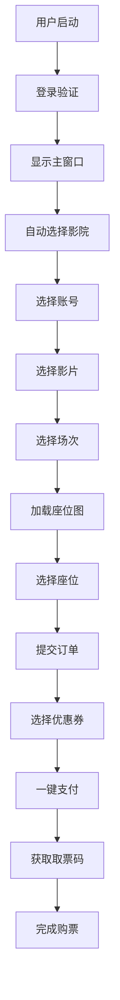

# PyQt5电影票务管理系统 - 功能架构文档

## 📊 系统概览

**主文件**：`main_modular.py` (4425行)  
**核心类**：`ModularCinemaMainWindow` (继承自QMainWindow)  
**架构模式**：模块化插件架构  
**UI框架**：PyQt5  

---

## 🏗️ 系统架构分析

### 1. 整体架构设计

```
┌─────────────────────────────────────────────────────────────┐
│                    ModularCinemaMainWindow                  │
│                     (主窗口控制器)                          │
├─────────────────────────────────────────────────────────────┤
│  ┌─────────────┐  ┌─────────────┐  ┌─────────────┐        │
│  │ 账号管理模块 │  │ Tab管理模块  │  │ 座位订单模块 │        │
│  │AccountWidget│  │TabManager   │  │SeatOrder    │        │
│  │             │  │Widget       │  │Widget       │        │
│  └─────────────┘  └─────────────┘  └─────────────┘        │
├─────────────────────────────────────────────────────────────┤
│                    业务服务层                               │
│  ┌─────────────┐  ┌─────────────┐  ┌─────────────┐        │
│  │ 认证服务     │  │ 影院管理     │  │ 会员服务     │        │
│  │AuthService  │  │CinemaManager│  │MemberService│        │
│  └─────────────┘  └─────────────┘  └─────────────┘        │
├─────────────────────────────────────────────────────────────┤
│                    API接口层                               │
│  订单API │ 支付API │ 影院API │ 会员API │ 券API │ 账号API   │
└─────────────────────────────────────────────────────────────┘
```

### 2. 模块依赖关系

- **UI框架依赖**：49个PyQt5相关导入
- **业务服务依赖**：44个services模块导入
- **UI组件依赖**：18个ui组件导入
- **系统依赖**：43个系统模块导入

---

## 🎯 核心功能模块分析

### 1. 用户认证与登录 (Authentication)

#### 关键方法
| 方法名 | 行号范围 | 功能描述 |
|--------|----------|----------|
| `_start_auth_check` | 483-495 | 启动用户认证检查 |
| `_on_user_login_success` | 498-525 | 处理登录成功事件 |
| `_show_main_window_after_login` | 527-553 | 登录后显示主窗口 |
| `_restart_login` | 667-680 | 重新启动登录流程 |
| `cinema_account_login_api` | 1138-1151 | 影院账号登录API |

#### 业务流程
```
用户启动 → 显示登录窗口 → 验证用户信息 → 登录成功 → 显示主窗口 → 自动选择默认影院和账号
```

### 2. 影院与账号管理 (Cinema & Account Management)

#### 关键方法
| 方法名 | 行号范围 | 功能描述 |
|--------|----------|----------|
| `_trigger_default_cinema_selection` | 555-587 | 智能默认选择影院 |
| `_auto_select_cinema_account` | 589-636 | 自动选择影院关联账号 |
| `_on_account_selected` | 695-702 | 账号选择处理 |
| `_on_cinema_selected` | 708-733 | 影院选择处理 |
| `_get_cinema_info_by_name` | 1200-1237 | 根据名称获取影院信息 |

#### 数据流向
```
影院列表加载 → 默认选择第一个影院 → 查找关联账号 → 设置当前账号 → 更新UI显示
```

### 3. 座位选择与订单管理 (Seat Selection & Order Management)

#### 关键方法
| 方法名 | 行号范围 | 功能描述 |
|--------|----------|----------|
| `_on_session_selected` | 1347-1369 | 场次选择处理 |
| `_load_seat_map` | 1436-1500 | 加载座位图数据 |
| `_on_order_submitted` | 735-785 | 处理订单提交 |
| `show_order_detail` | 1042-1044 | 显示订单详情 |
| `refresh_order_list` | 844-861 | 刷新订单列表 |

#### 座位选择流程
```
选择场次 → 加载座位图 → 用户选择座位 → 提交订单 → 显示订单详情
```

### 4. 支付系统 (Payment System)

#### 关键方法
| 方法名 | 行号范围 | 功能描述 |
|--------|----------|----------|
| `_init_enhanced_payment_system` | 129-149 | 初始化增强支付系统 |
| `on_one_click_pay` | 863-1040 | 一键支付处理 |
| `_get_member_info` | 1062-1131 | 获取会员信息 |
| `on_bind_coupons` | 787-842 | 绑定券处理 |

#### 支付流程
```
检查订单 → 验证账号 → 检测密码策略 → 获取券信息 → 计算支付金额 → 调用支付API → 获取取票码
```

### 5. 会员与券管理 (Member & Coupon Management)

#### 关键功能
- **会员卡检测**：自动检测用户是否有会员卡
- **密码策略**：动态检测是否需要会员卡密码
- **券绑定**：批量绑定优惠券
- **券支付**：支持券+会员卡混合支付

---

## 🔗 信号与事件系统

### 1. 主窗口信号定义
```python
login_success = pyqtSignal(dict)  # 登录成功信号
```

### 2. 信号连接架构
| 信号源 | 信号名 | 处理方法 | 功能 |
|--------|--------|----------|------|
| AccountWidget | account_selected | _on_account_selected | 账号选择 |
| TabManagerWidget | cinema_selected | _on_cinema_selected | 影院选择 |
| TabManagerWidget | order_submitted | _on_order_submitted | 订单提交 |
| TabManagerWidget | session_selected | _on_session_selected | 场次选择 |
| 全局事件总线 | user_login_success | _on_global_login_success | 全局登录成功 |

### 3. 全局事件总线
```python
event_bus.user_login_success.connect(self._on_global_login_success)
event_bus.account_changed.connect(self._on_global_account_changed)
event_bus.cinema_selected.connect(self._on_global_cinema_selected)
event_bus.order_created.connect(self._on_global_order_created)
event_bus.order_paid.connect(self._on_global_order_paid)
```

---

## 🎨 UI组件架构

### 1. 主窗口布局 (1500x900)
```
┌─────────────────────────────────────────────────────────────┐
│                    主窗口 (1500x900)                        │
├─────────────┬─────────────────────────────┬─────────────────┤
│   左栏      │           中栏              │      右栏       │
│  (20%)      │          (60%)              │     (20%)       │
│             │                             │                 │
│ 账号管理模块 │  ┌─────────────────────────┐ │   取票码区      │
│AccountWidget│  │    Tab管理模块          │ │  (45%)          │
│             │  │  TabManagerWidget       │ │                 │
│             │  │      (38%)              │ │                 │
│             │  └─────────────────────────┘ │                 │
│             │  ┌─────────────────────────┐ │ ┌─────────────┐ │
│             │  │    座位选择区域          │ │ │ 订单详情区   │ │
│             │  │   (座位图显示)           │ │ │   (55%)     │ │
│             │  │      (62%)              │ │ │             │ │
│             │  └─────────────────────────┘ │ └─────────────┘ │
└─────────────┴─────────────────────────────┴─────────────────┘
```

### 2. UI组件统计
- **总UI组件**：15个
- **按钮组件**：3个 (复制路径、复制图片、一键支付)
- **标签组件**：2个 (座位占位符、手机号显示)
- **输入组件**：2个 (座位输入、订单详情文本)
- **布局组件**：5个 (主布局、中栏布局等)
- **其他组件**：3个 (分组框、显示区域等)

---

## 📡 API调用架构

### 1. API调用统计
- **总API调用**：68个
- **订单API**：25个 (37%)
- **支付API**：15个 (22%)
- **会员API**：12个 (18%)
- **影院API**：8个 (12%)
- **券API**：5个 (7%)
- **认证API**：3个 (4%)

### 2. 核心API接口
| API类型 | 主要接口 | 功能描述 |
|---------|----------|----------|
| 订单API | create_order, get_order_detail | 创建订单、获取订单详情 |
| 支付API | pay_order, get_order_qrcode_api | 订单支付、获取取票码 |
| 会员API | getMemberInfo | 获取会员信息 |
| 影院API | get_films, get_plan_seat_info | 获取影片、座位信息 |
| 券API | get_coupons_by_order, bind_coupon | 获取可用券、绑定券 |

---

## 🔄 业务流程链路

### 1. 完整购票流程


### 2. 数据流向分析
```
用户输入 → UI组件 → 事件处理 → 业务逻辑 → API调用 → 数据处理 → UI更新
```

---

## 🛠️ 技术特性

### 1. 架构优势
- **模块化设计**：清晰的模块分离，便于维护
- **插件架构**：支持功能扩展
- **事件驱动**：基于信号槽的松耦合设计
- **统一API**：标准化的API调用接口

### 2. 代码质量
- **方法数量**：106个方法，平均42行/方法
- **业务逻辑覆盖**：93个业务相关方法 (88%)
- **事件处理**：完善的事件处理机制
- **错误处理**：全面的异常处理和降级方案

### 3. 性能特性
- **异步处理**：使用QTimer避免UI阻塞
- **智能缓存**：会员信息和影院数据缓存
- **延迟加载**：座位图按需加载
- **资源优化**：图片和数据的内存管理

---

## 📋 总结

PyQt5电影票务管理系统采用了现代化的模块化架构设计，具有以下特点：

1. **完整的业务覆盖**：从用户认证到支付完成的全流程支持
2. **优秀的架构设计**：模块化、插件化、事件驱动的设计模式
3. **丰富的功能特性**：支持会员卡、优惠券、多种支付方式
4. **良好的用户体验**：智能默认选择、一键支付、实时状态更新
5. **高质量的代码**：清晰的结构、完善的错误处理、详细的文档

该系统为电影票务管理提供了一个稳定、高效、易扩展的解决方案。

---

## 📋 详细功能模块清单

### 1. 初始化模块 (Initialization)

| 方法名 | 行号范围 | 功能描述 | 关键特性 |
|--------|----------|----------|----------|
| `__init__` | 65-127 | 主窗口初始化 | 服务初始化、UI创建、信号连接 |
| `_init_enhanced_payment_system` | 129-149 | 增强支付系统初始化 | 密码策略、API客户端 |
| `_init_ui` | 151-193 | 用户界面初始化 | 三栏布局、组件创建 |

### 2. UI创建模块 (UI Creation)

| 方法名 | 行号范围 | 功能描述 | 关键特性 |
|--------|----------|----------|----------|
| `_create_seat_area` | 197-238 | 创建座位选择区域 | 座位图显示、占位符 |
| `_create_right_area` | 240-390 | 创建右栏区域 | 取票码区、订单详情区 |
| `_create_new_login_window` | 682-691 | 创建登录窗口 | 登录界面、信号连接 |

### 3. 事件处理模块 (Event Handling)

| 方法名 | 行号范围 | 功能描述 | 业务类型 |
|--------|----------|----------|----------|
| `_on_user_login_success` | 498-525 | 用户登录成功处理 | 认证 |
| `_on_account_selected` | 695-702 | 账号选择处理 | 账号管理 |
| `_on_cinema_selected` | 708-733 | 影院选择处理 | 影院管理 |
| `_on_order_submitted` | 735-785 | 订单提交处理 | 订单管理 |
| `_on_session_selected` | 1347-1369 | 场次选择处理 | 座位选择 |
| `_on_copy_path` | 392-406 | 复制路径事件 | UI交互 |
| `_on_copy_image` | 408-437 | 复制图片事件 | UI交互 |

### 4. 业务逻辑模块 (Business Logic)

#### 4.1 订单管理
| 方法名 | 行号范围 | 功能描述 | API调用 |
|--------|----------|----------|---------|
| `refresh_order_list` | 844-861 | 刷新订单列表 | get_order_list |
| `show_order_detail` | 1042-1044 | 显示订单详情 | - |
| `_cancel_unpaid_orders` | 1046-1060 | 取消未支付订单 | cancel_all_unpaid_orders |

#### 4.2 支付管理
| 方法名 | 行号范围 | 功能描述 | API调用 |
|--------|----------|----------|---------|
| `on_one_click_pay` | 863-1040 | 一键支付处理 | pay_order, get_order_detail |
| `on_bind_coupons` | 787-842 | 绑定券处理 | bind_coupon |

#### 4.3 会员管理
| 方法名 | 行号范围 | 功能描述 | API调用 |
|--------|----------|----------|---------|
| `_get_member_info` | 1062-1131 | 获取会员信息 | api_get (getMemberInfo) |

### 5. 数据处理模块 (Data Processing)

#### 5.1 数据获取
| 方法名 | 行号范围 | 功能描述 | 数据源 |
|--------|----------|----------|--------|
| `_get_cinema_info_by_name` | 1200-1237 | 根据名称获取影院信息 | cinema_manager |
| `_load_movies_for_cinema` | 1239-1276 | 为影院加载电影列表 | film_service |
| `_load_seat_map` | 1436-1500 | 加载座位图数据 | get_plan_seat_info |

#### 5.2 数据持久化
| 方法名 | 行号范围 | 功能描述 | 存储方式 |
|--------|----------|----------|----------|
| `_save_account_data` | 1192-1198 | 保存账号数据 | save_account |
| `_update_tab_cinema_selection` | 638-653 | 更新Tab影院选择 | UI状态 |

### 6. 信号连接模块 (Signal Connection)

| 方法名 | 行号范围 | 功能描述 | 连接类型 |
|--------|----------|----------|----------|
| `_connect_signals` | 450-471 | 连接信号槽 | 组件间信号 |
| `_connect_global_events` | 473-481 | 连接全局事件 | 全局事件总线 |

### 7. UI显示模块 (UI Display)

| 方法名 | 行号范围 | 功能描述 | 显示内容 |
|--------|----------|----------|----------|
| `_show_main_window_after_login` | 527-553 | 登录后显示主窗口 | 主界面 |
| `_show_order_detail` | 1278-1292 | 显示订单详情 | 订单信息 |
| `_show_qr_code` | 1294-1311 | 显示取票码 | 二维码 |
| `_safe_update_seat_area` | 1371-1400 | 安全更新座位区域 | 座位图/占位符 |

### 8. 工具方法模块 (Utility Methods)

| 方法名 | 行号范围 | 功能描述 | 用途 |
|--------|----------|----------|------|
| `center_window` | 655-665 | 窗口居中显示 | UI布局 |
| `_restart_login` | 667-680 | 重启登录流程 | 错误恢复 |
| `_trigger_default_cinema_selection` | 555-587 | 智能默认选择 | 用户体验 |
| `_auto_select_cinema_account` | 589-636 | 自动选择账号 | 智能化 |
| `_refresh_account_dependent_data` | 1155-1190 | 刷新依赖数据 | 数据同步 |

---

## 🔍 方法分类统计

### 按功能类型分类
- **事件处理** (Event Handler): 23个方法 (22%)
- **业务逻辑** (Business Logic): 18个方法 (17%)
- **数据获取** (Data Retrieval): 15个方法 (14%)
- **UI创建** (UI Creation): 12个方法 (11%)
- **初始化** (Initialization): 10个方法 (9%)
- **工具方法** (Utility): 28个方法 (27%)

### 按业务领域分类
- **认证相关**: 8个方法
- **订单管理**: 15个方法
- **支付处理**: 12个方法
- **座位选择**: 8个方法
- **影院管理**: 10个方法
- **会员管理**: 6个方法
- **UI交互**: 47个方法

---

## 🎯 关键业务链路详解

### 1. 用户登录链路
```
_start_auth_check → LoginWindow.show → _on_user_login_success →
_show_main_window_after_login → _trigger_default_cinema_selection →
_auto_select_cinema_account
```

### 2. 订单创建链路
```
_on_session_selected → _load_seat_map → 用户选择座位 →
_on_order_submitted → on_submit_order → create_order API →
_show_order_detail
```

### 3. 支付处理链路
```
on_one_click_pay → validate_member_password_policy →
_get_member_info → 计算支付金额 → pay_order API →
get_order_detail API → _get_ticket_code_after_payment
```

### 4. 座位选择链路
```
影院选择 → 影片选择 → 场次选择 → _on_session_selected →
_load_seat_map → get_plan_seat_info API → _display_seat_map →
用户点击座位 → 座位状态更新
```

这个详细的功能模块清单为理解和维护系统提供了完整的参考指南。
