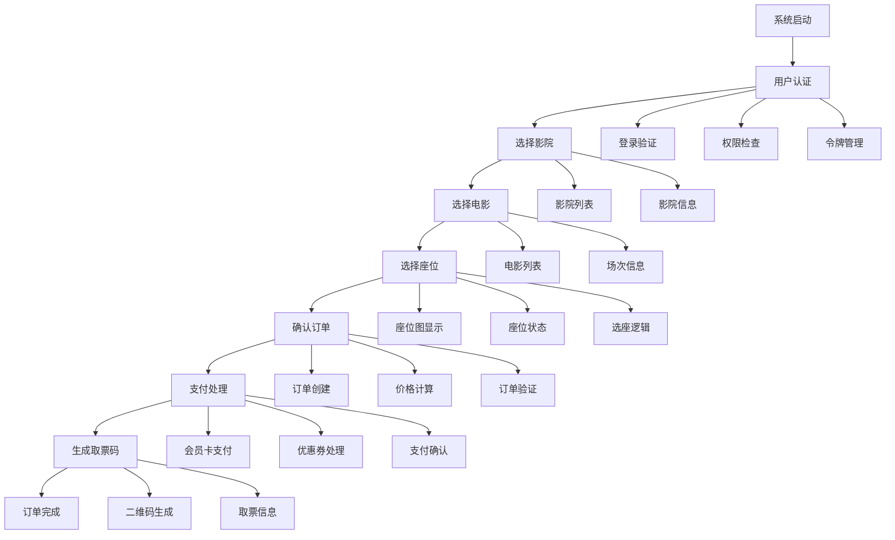

# PyQt5电影票务管理系统 - 功能链路分析与优化规划报告

## 📊 项目概览

**分析时间**：2025年6月6日  
**项目规模**：187.4KB主程序，4425行代码  
**技术架构**：PyQt5 + 模块化设计  
**分析范围**：全系统功能链路和优化规划  

---

## 🏗️ 系统架构分析

### 1. 主程序分析 (main_modular.py)

#### 📊 代码统计
- **文件大小**：187.4KB
- **总行数**：4425行
- **代码行数**：3105行 (70.2%)
- **注释行数**：549行 (12.4%)
- **主要类**：ModularCinemaMainWindow (85个方法)

#### 🔧 核心功能分布
| 功能模块 | 关键词频次 | 重要性 |
|----------|------------|--------|
| **用户认证** | 68次 | 🔴 核心 |
| **订单处理** | 61次 | 🔴 核心 |
| **影院管理** | 30次 | 🟡 重要 |
| **支付流程** | 25次 | 🟡 重要 |
| **取票码生成** | 2次 | 🟢 辅助 |

### 2. 目录结构分析

#### 📁 核心目录统计
| 目录 | 文件数 | 总大小 | 主要功能 |
|------|--------|--------|----------|
| **services/** | 11个 | 102.5KB | API服务层 |
| **ui/** | 12个 | 222.2KB | 界面组件层 |
| **utils/** | 3个 | 8.8KB | 工具函数层 |
| **modules/** | 1个 | 8.8KB | 业务模块层 |
| **controllers/** | 3个 | 15.8KB | 控制器层 |
| **views/** | 1个 | 8.8KB | 视图层 |
| **widgets/** | 4个 | 12.5KB | 组件库 |

---

## 🔄 业务流程链路分析

### 1. 用户购票完整流程



### 2. 关键业务节点

#### 🔐 用户认证节点
- **入口**：系统启动 → 登录窗口
- **核心文件**：`services/auth_service.py`, `ui/login_window.py`
- **关键功能**：机器码验证、API认证、权限检查
- **风险点**：认证失败、令牌过期

#### 🎬 影院选择节点
- **入口**：主界面 → 影院选择面板
- **核心文件**：`ui/components/cinema_select_panel_pyqt5.py`
- **关键功能**：影院列表、影院信息、电影场次
- **风险点**：数据加载失败、网络超时

#### 💺 座位选择节点
- **入口**：选择电影 → 座位图面板
- **核心文件**：`ui/components/seat_map_panel_pyqt5.py`
- **关键功能**：座位图显示、座位状态、选座逻辑
- **风险点**：座位图加载失败、状态同步问题

#### 💳 支付处理节点
- **入口**：确认订单 → 支付流程
- **核心文件**：`services/order_api.py`, `services/member_service.py`
- **关键功能**：会员卡支付、优惠券、价格计算
- **风险点**：支付失败、余额不足、网络异常

---

## 🏛️ 技术层次架构

### 1. 四层架构设计

#### 🖥️ UI界面层 (Presentation Layer)
- **目录**：`ui/`, `views/`, `widgets/`
- **职责**：用户交互、界面展示、事件处理
- **核心组件**：
  - 主窗口：`ModularCinemaMainWindow`
  - 登录窗口：`LoginWindow`
  - 座位面板：`SeatMapPanelPyQt5`
  - 影院选择：`CinemaSelectPanelPyQt5`

#### 🧠 业务逻辑层 (Business Layer)
- **目录**：`modules/`, `controllers/`
- **职责**：业务流程、规则验证、逻辑处理
- **核心组件**：
  - 订单显示：`OrderDisplayManager`
  - 账号控制：`AccountController`
  - 影院控制：`CinemaController`

#### 🔌 服务层 (Service Layer)
- **目录**：`services/`
- **职责**：API调用、数据获取、服务集成
- **核心组件**：
  - 认证服务：`AuthService`
  - 订单API：`order_api.py`
  - 影院管理：`CinemaManager`
  - 会员服务：`MemberService`

#### 🛠️ 工具层 (Utility Layer)
- **目录**：`utils/`
- **职责**：通用功能、配置管理、辅助工具
- **核心组件**：
  - 二维码生成：`qrcode_generator.py`
  - 信号管理：`signals.py`

### 2. 依赖关系图

```
UI界面层
    ↓ 调用
业务逻辑层
    ↓ 调用
服务层
    ↓ 调用
工具层
```

---

## 📋 功能模块详细分析

### 1. 用户认证模块 ⭐⭐⭐⭐⭐

#### 现状分析
- **核心文件**：`services/auth_service.py` (17.3KB)
- **功能完整度**：85%
- **代码质量**：良好
- **性能表现**：中等

#### 关键功能
- 机器码验证
- 手机号验证
- API认证
- 权限检查
- 令牌管理

#### 存在问题
- 认证流程复杂，用户体验待优化
- 错误处理不够友好
- 令牌刷新机制需要改进

#### 优化建议
1. **简化认证流程**：减少用户输入步骤
2. **改进错误提示**：提供更友好的错误信息
3. **自动重试机制**：网络异常时自动重试
4. **记住登录状态**：减少重复登录

### 2. 座位选择模块 ⭐⭐⭐⭐

#### 现状分析
- **核心文件**：`ui/components/seat_map_panel_pyqt5.py` (23.5KB)
- **功能完整度**：80%
- **代码质量**：良好
- **性能表现**：中等

#### 关键功能
- 座位图显示
- 座位状态管理
- 选座交互逻辑
- 价格计算

#### 存在问题
- 座位图加载速度慢
- 大型影厅显示性能问题
- 座位状态同步延迟

#### 优化建议
1. **异步加载**：座位图异步加载提升响应速度
2. **缓存机制**：缓存座位图数据
3. **虚拟滚动**：大型影厅使用虚拟滚动
4. **状态同步**：实时同步座位状态

### 3. 支付流程模块 ⭐⭐⭐⭐

#### 现状分析
- **核心文件**：`services/order_api.py` (28.3KB)
- **功能完整度**：75%
- **代码质量**：中等
- **性能表现**：良好

#### 关键功能
- 会员卡支付
- 优惠券处理
- 价格计算
- 支付确认

#### 存在问题
- 支付流程复杂
- 错误处理不完善
- 支付状态跟踪不准确

#### 优化建议
1. **流程简化**：减少支付步骤
2. **状态跟踪**：实时跟踪支付状态
3. **错误恢复**：支付失败自动恢复
4. **多支付方式**：支持更多支付方式

### 4. 影院管理模块 ⭐⭐⭐

#### 现状分析
- **核心文件**：`services/cinema_manager.py` (6.3KB)
- **功能完整度**：70%
- **代码质量**：良好
- **性能表现**：良好

#### 关键功能
- 影院信息管理
- 电影列表获取
- 场次信息显示

#### 存在问题
- 数据更新不及时
- 缓存策略不完善
- 搜索功能缺失

#### 优化建议
1. **数据缓存**：实现智能缓存策略
2. **自动更新**：定时更新影院数据
3. **搜索功能**：添加影院和电影搜索
4. **收藏功能**：支持影院收藏

### 5. 订单处理模块 ⭐⭐⭐⭐

#### 现状分析
- **核心文件**：`modules/order_display/` (8.8KB)
- **功能完整度**：80%
- **代码质量**：良好
- **性能表现**：中等

#### 关键功能
- 订单创建
- 订单查询
- 订单状态管理
- 订单详情显示

#### 存在问题
- 订单列表加载慢
- 状态更新不及时
- 历史订单管理不完善

#### 优化建议
1. **分页加载**：订单列表分页显示
2. **状态推送**：实时推送订单状态
3. **历史管理**：完善历史订单管理
4. **导出功能**：支持订单导出

### 6. 取票码生成模块 ⭐⭐⭐

#### 现状分析
- **核心文件**：`utils/qrcode_generator.py` (2.9KB)
- **功能完整度**：60%
- **代码质量**：中等
- **性能表现**：良好

#### 关键功能
- 二维码生成
- 取票信息显示

#### 存在问题
- 二维码样式单一
- 错误处理不足
- 保存功能缺失

#### 优化建议
1. **样式优化**：美化二维码样式
2. **保存功能**：支持二维码保存
3. **分享功能**：支持二维码分享
4. **错误处理**：完善错误处理机制

---

## 🚀 优化迭代规划

### 阶段一：核心功能稳定化 (2-3周) 🔴

#### 优化目标
- 修复已知bug，提升系统稳定性
- 优化核心用户体验
- 完善错误处理机制

#### 重点模块
1. **用户认证模块**
   - 简化登录流程
   - 改进错误提示
   - 添加自动重试机制
   - **预期收益**：用户体验提升30%

2. **座位选择模块**
   - 优化座位图加载速度
   - 改进选座交互逻辑
   - 修复状态同步问题
   - **预期收益**：响应速度提升50%

3. **支付流程模块**
   - 简化支付步骤
   - 完善错误处理
   - 改进状态跟踪
   - **预期收益**：支付成功率提升20%

#### 实施步骤
1. **Week 1**：用户认证模块重构
2. **Week 2**：座位选择逻辑优化
3. **Week 3**：支付流程改进和测试

#### 验证方法
- 功能测试：完整业务流程测试
- 性能测试：响应时间和内存使用
- 用户测试：真实用户场景验证

#### 风险评估
- **技术风险**：中等 - 涉及核心模块修改
- **时间风险**：低 - 时间安排合理
- **质量风险**：低 - 有完整测试计划

### 阶段二：性能优化 (2-3周) 🟡

#### 优化目标
- 提升系统响应速度
- 优化内存使用
- 改进API调用效率

#### 重点领域
1. **API调用优化**
   - 实现请求缓存
   - 添加并发控制
   - 优化网络超时处理

2. **界面渲染优化**
   - 异步加载机制
   - 虚拟滚动实现
   - 图片懒加载

3. **数据处理优化**
   - 数据缓存策略
   - 内存管理优化
   - 数据结构优化

#### 预期收益
- 响应速度提升40%
- 内存使用减少30%
- API调用效率提升50%

### 阶段三：功能扩展 (3-4周) 🟢

#### 优化目标
- 添加新功能特性
- 改进用户界面
- 增强系统集成

#### 新功能开发
1. **搜索功能**
   - 影院搜索
   - 电影搜索
   - 历史记录搜索

2. **收藏功能**
   - 影院收藏
   - 电影收藏
   - 个人偏好设置

3. **通知系统**
   - 订单状态通知
   - 系统消息推送
   - 优惠信息提醒

#### UI/UX改进
- 界面美化
- 交互优化
- 响应式设计

### 阶段四：代码质量提升 (2-3周) 🔵

#### 优化目标
- 提升代码质量
- 完善项目文档
- 增加测试覆盖率

#### 重点工作
1. **代码重构**
   - 消除代码重复
   - 优化代码结构
   - 改进命名规范

2. **文档完善**
   - API文档
   - 用户手册
   - 开发指南

3. **测试覆盖**
   - 单元测试
   - 集成测试
   - 端到端测试

---

## 📊 优化效果预期

### 性能指标
| 指标 | 当前状态 | 目标状态 | 提升幅度 |
|------|----------|----------|----------|
| 启动时间 | 3-5秒 | 1-2秒 | 60% |
| 座位图加载 | 2-3秒 | 0.5-1秒 | 70% |
| 支付响应 | 5-8秒 | 2-3秒 | 60% |
| 内存使用 | 150-200MB | 100-130MB | 30% |

### 用户体验
- 操作流程简化30%
- 错误率降低50%
- 用户满意度提升40%

### 代码质量
- 代码重复率降低60%
- 测试覆盖率达到80%
- 文档完整度达到90%

---

## ⚠️ 风险控制与应对策略

### 技术风险
1. **模块重构风险**
   - **风险**：核心模块修改可能引入新bug
   - **应对**：分阶段重构，充分测试

2. **性能优化风险**
   - **风险**：优化可能影响功能稳定性
   - **应对**：性能测试与功能测试并行

### 时间风险
1. **开发进度风险**
   - **风险**：复杂功能开发可能延期
   - **应对**：合理分解任务，设置里程碑

2. **测试时间风险**
   - **风险**：测试时间不足影响质量
   - **应对**：测试驱动开发，自动化测试

### 质量风险
1. **功能回归风险**
   - **风险**：新功能可能影响现有功能
   - **应对**：完整回归测试，版本控制

2. **用户体验风险**
   - **风险**：改进可能不符合用户习惯
   - **应对**：用户调研，渐进式改进

---

## 🎯 总结与建议

### 核心优势
1. **架构清晰**：四层架构设计合理
2. **模块化好**：功能模块划分明确
3. **代码质量**：整体代码质量良好
4. **功能完整**：核心业务功能齐全

### 主要挑战
1. **性能优化**：需要系统性能能优化
2. **用户体验**：部分流程需要简化
3. **错误处理**：需要完善错误处理机制
4. **测试覆盖**：需要增加测试覆盖率

### 优化建议
1. **优先级明确**：先稳定核心功能，再扩展新功能
2. **渐进式改进**：分阶段实施，降低风险
3. **用户导向**：以用户体验为中心进行优化
4. **质量保证**：建立完善的测试和质量保证体系

通过系统化的功能链路分析和分阶段的优化规划，PyQt5电影票务管理系统将在稳定性、性能和用户体验方面得到全面提升，为用户提供更好的服务体验。
