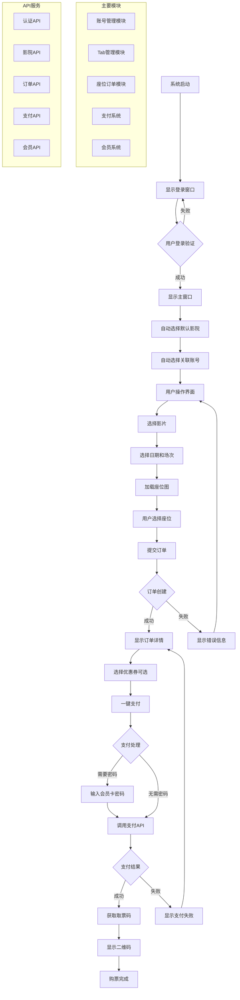
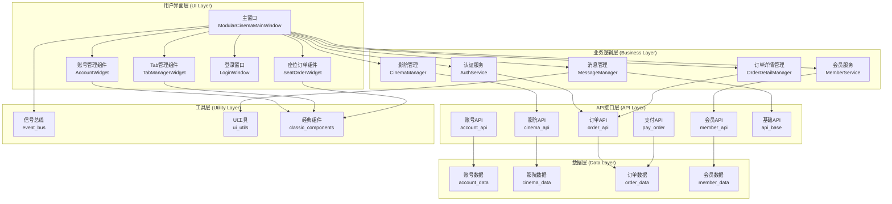

# PyQt5电影票务管理系统图表

## 📊 业务流程图

以下图表展示了从用户启动系统到完成购票的完整业务流程：



## 🏗️ 系统架构图

以下图表展示了系统的分层架构设计：



## 📋 使用说明

### 查看图表
1. **GitHub/GitLab**: 支持直接显示Mermaid图表
2. **Typora**: 支持Mermaid图表渲染
3. **VS Code**: 安装Mermaid插件后可预览
4. **在线编辑器**: 访问 [mermaid.live](https://mermaid.live)

### 转换为图片
如果需要转换为PNG/SVG格式，请安装mermaid-cli：
```bash
npm install -g @mermaid-js/mermaid-cli
```

然后运行转换命令：
```bash
# 转换为PNG
mmdc -i PyQt5电影票务系统业务流程图.mmd -o 业务流程图.png

# 转换为SVG
mmdc -i PyQt5电影票务系统架构图.mmd -o 架构图.svg
```
