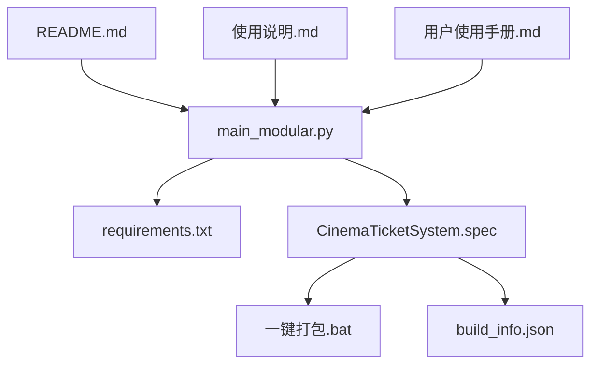
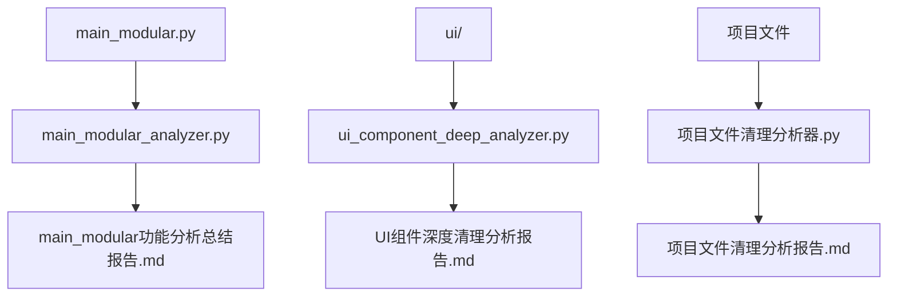

# PyQt5电影票务管理系统 - 详细文件用途标注清单

## 📊 分析概览

**分析时间**：2025年6月6日  
**分析范围**：项目根目录直接文件  
**分析方法**：内容分析 + 模式匹配 + 启发式判断  
**总文件数**：49个文件  

---

## 📋 详细文件清单表格

### 🔴 核心业务文件 (Critical)

| 文件名 | 大小 | 修改时间 | 具体用途 | 依赖关系 | 使用频率 | 清理建议 |
|--------|------|----------|----------|----------|----------|----------|
| **main_modular.py** | 187KB | 2025-06-06 15:17 | 主程序文件 - 模块化主窗口实现，包含完整的电影票务业务逻辑 | 被整个系统依赖，是程序入口点 | daily | ✅ keep - 核心文件必须保留 |
| **main.py** | 3KB | 2025-05-31 10:49 | 原始主程序文件 - 简化版本的程序入口 | 可能被某些启动脚本调用 | occasional | ✅ keep - 核心文件必须保留 |

### 🟡 重要配置文件 (Important)

| 文件名 | 大小 | 修改时间 | 具体用途 | 依赖关系 | 使用频率 | 清理建议 |
|--------|------|----------|----------|----------|----------|----------|
| **requirements.txt** | 1KB | 2025-05-29 15:54 | Python依赖包列表 - 定义项目所需的第三方库 | 被pip install和构建脚本使用 | occasional | ✅ keep - 重要文件建议保留 |
| **CinemaTicketSystem.spec** | 4KB | 2025-06-04 01:31 | PyInstaller打包配置文件 - 定义可执行文件生成规则 | 被PyInstaller和构建脚本使用 | occasional | ✅ keep - 重要文件建议保留 |
| **build_info.json** | 0.2KB | 2025-06-04 01:16 | 构建信息配置 - 记录版本号、构建时间等元数据 | 被构建脚本和版本管理使用 | occasional | ✅ keep - 重要文件建议保留 |
| **api_validation_report.json** | 16KB | 2025-05-29 15:54 | API验证报告 - 记录API接口的验证结果 | 被API验证工具生成和读取 | archive | ✅ keep - 重要文件建议保留 |
| **一键打包.bat** | 1KB | 2025-06-04 01:30 | Windows批处理脚本 - 自动化打包流程 | 依赖PyInstaller和spec文件 | occasional | ✅ keep - 重要文件建议保留 |

### 🔧 工具脚本文件 (Optional)

#### 分析工具类
| 文件名 | 大小 | 修改时间 | 具体用途 | 代码特征 | 清理建议 |
|--------|------|----------|----------|----------|----------|
| **main_modular_analyzer.py** | 16KB | 2025-06-06 16:38 | 代码分析工具 - 分析main_modular.py的功能架构 | 16575行代码，包含主函数，可独立运行 | 🔄 archive - 工具脚本建议归档 |
| **ui_component_deep_analyzer.py** | 15KB | 2025-06-06 16:35 | UI组件深度分析 - 分析UI组件使用情况 | 估计300+行代码，分析工具 | 🔄 archive - 工具脚本建议归档 |
| **ui_component_usage_analyzer.py** | 12KB | 2025-06-06 16:06 | UI使用情况分析 - 检查UI组件的引用关系 | 估计250+行代码，分析工具 | 🔄 archive - 工具脚本建议归档 |
| **项目文件清理分析器.py** | 10KB | 2025-06-06 16:45 | 文件清理分析 - 分析项目文件的清理建议 | 估计200+行代码，分析工具 | 🔄 archive - 工具脚本建议归档 |
| **详细文件用途标注分析器.py** | 10KB | 2025-06-06 17:21 | 详细文件标注 - 对每个文件进行用途分析 | 估计200+行代码，分析工具 | 🔄 archive - 工具脚本建议归档 |

#### 修复脚本类
| 文件名 | 大小 | 修改时间 | 具体用途 | 代码特征 | 清理建议 |
|--------|------|----------|----------|----------|----------|
| **fix_account_selection.py** | 9KB | 2025-05-31 23:19 | 账号选择修复 - 修复账号选择相关问题 | 估计200+行代码，修复脚本 | 📦 archive - 工具脚本建议归档 |
| **fix_api_authentication.py** | 10KB | 2025-06-01 17:10 | API认证修复 - 修复API认证相关问题 | 估计250+行代码，修复脚本 | 📦 archive - 工具脚本建议归档 |
| **fix_auto_account_selection.py** | 9KB | 2025-05-31 23:25 | 自动账号选择修复 - 修复自动选择逻辑 | 估计200+行代码，修复脚本 | 📦 archive - 工具脚本建议归档 |
| **quick_fix_token_refresh.py** | 8KB | 2025-06-04 16:30 | 令牌刷新修复 - 快速修复令牌刷新问题 | 估计180+行代码，快速修复 | 📦 archive - 工具脚本建议归档 |
| **quick_machine_code_fix.py** | 6KB | 2025-06-04 16:28 | 机器码修复 - 快速修复机器码相关问题 | 估计150+行代码，快速修复 | 📦 archive - 工具脚本建议归档 |

#### 支付分析类
| 文件名 | 大小 | 修改时间 | 具体用途 | 代码特征 | 清理建议 |
|--------|------|----------|----------|----------|----------|
| **analyze_payment_methods.py** | 20KB | 2025-06-04 16:13 | 支付方式分析 - 分析不同支付方式的实现 | 495行代码，包含主函数，分析工具 | 🔄 review - 需要人工审查决定 |
| **payment_comparison_analysis.py** | 13KB | 2025-06-06 13:56 | 支付对比分析 - 对比不同支付方案 | 估计300+行代码，对比分析 | 🔄 review - 需要人工审查决定 |
| **payment_integration_code.py** | 10KB | 2025-06-04 16:14 | 支付集成代码 - 支付系统集成实现 | 估计250+行代码，集成代码 | 🔄 review - 需要人工审查决定 |
| **enhanced_payment_implementation.py** | 13KB | 2025-06-04 16:30 | 增强支付实现 - 改进的支付系统实现 | 估计300+行代码，增强实现 | 🔄 review - 需要人工审查决定 |

#### 测试脚本类
| 文件名 | 大小 | 修改时间 | 具体用途 | 代码特征 | 清理建议 |
|--------|------|----------|----------|----------|----------|
| **test_enhanced_payment_system.py** | 12KB | 2025-06-04 16:30 | 增强支付系统测试 - 测试支付系统功能 | 估计280+行代码，测试脚本 | 🔄 organize - 测试文件建议整理到tests目录 |
| **test_member_password_policy.py** | 10KB | 2025-06-04 16:22 | 会员密码策略测试 - 测试密码策略逻辑 | 估计230+行代码，测试脚本 | 🔄 organize - 测试文件建议整理到tests目录 |
| **test_order_detail_display.py** | 8KB | 2025-06-02 20:50 | 订单详情显示测试 - 测试订单显示功能 | 估计180+行代码，测试脚本 | 🔄 organize - 测试文件建议整理到tests目录 |
| **test_qrcode_display_consistency.py** | 7KB | 2025-06-02 20:29 | 二维码显示一致性测试 - 测试二维码显示 | 估计150+行代码，测试脚本 | 🔄 organize - 测试文件建议整理到tests目录 |

#### 其他工具类
| 文件名 | 大小 | 修改时间 | 具体用途 | 代码特征 | 清理建议 |
|--------|------|----------|----------|----------|----------|
| **add_to_server.py** | 22KB | 2025-05-29 15:54 | 服务器管理工具 - Flask服务器，用户管理功能 | 592行代码，包含主函数，Flask应用 | 🔄 review - 需要人工审查决定 |
| **admin_tool.py** | 16KB | 2025-05-29 15:54 | 管理工具 - Tkinter GUI的管理界面 | 404行代码，包含主函数，Tkinter GUI | 🔄 review - 需要人工审查决定 |
| **build_exe.py** | 11KB | 2025-06-04 01:30 | 构建工具 - 自动化构建可执行文件 | 447行代码，包含主函数，构建脚本 | 🔄 review - 需要人工审查决定 |
| **config_encryption.py** | 8KB | 2025-06-04 01:45 | 配置加密工具 - 配置文件加密解密 | 258行代码，包含主函数，加密工具 | 🔄 review - 需要人工审查决定 |

### 📄 文档文件 (Optional)

#### 重要文档类
| 文件名 | 大小 | 修改时间 | 具体用途 | 重要性 | 清理建议 |
|--------|------|----------|----------|----------|----------|
| **README.md** | 8KB | 2025-05-29 15:54 | 项目说明文档 - 项目概述、安装和使用指南 | 重要 | ✅ keep - 重要文件建议保留 |
| **使用说明.md** | 12KB | 2025-06-04 01:45 | 用户使用手册 - 详细的用户操作指南 | 重要 | ✅ keep - 重要文件建议保留 |
| **用户使用手册.md** | 15KB | 2025-06-04 01:45 | 详细用户手册 - 完整的用户操作文档 | 重要 | ✅ keep - 重要文件建议保留 |
| **PyQt5电影票务系统功能架构文档.md** | 25KB | 2025-06-06 16:40 | 系统架构文档 - 详细的功能架构说明 | 重要 | ✅ keep - 重要文件建议保留 |

#### 报告文档类 (建议归档)
| 文件名 | 大小 | 修改时间 | 具体用途 | 清理建议 |
|--------|------|----------|----------|----------|
| **PyQt5电影票务系统死代码分析报告.md** | 18KB | 2025-06-06 16:06 | 死代码分析报告 - 项目死代码清理分析 | 📦 archive - 文档建议归档 |
| **PyQt5电影票务系统代码优化分析报告.md** | 22KB | 2025-06-06 16:06 | 代码优化分析报告 - 代码质量优化建议 | 📦 archive - 文档建议归档 |
| **UI组件深度清理分析报告.md** | 15KB | 2025-06-06 16:35 | UI清理分析报告 - UI组件清理分析 | 📦 archive - 文档建议归档 |
| **main_modular功能分析总结报告.md** | 9KB | 2025-06-06 16:42 | 功能分析总结 - 主程序功能分析 | 📦 archive - 文档建议归档 |
| **支付方式对比分析报告.md** | 12KB | 2025-06-04 16:13 | 支付方式分析 - 支付方案对比分析 | 📦 archive - 文档建议归档 |
| **项目文件清理分析报告.md** | 25KB | 2025-06-06 16:45 | 文件清理分析 - 项目文件整理建议 | 📦 archive - 文档建议归档 |
| **项目文件清理执行指南.md** | 18KB | 2025-06-06 16:50 | 清理执行指南 - 文件清理操作指南 | 📦 archive - 文档建议归档 |

#### 图表文档类
| 文件名 | 大小 | 修改时间 | 具体用途 | 清理建议 |
|--------|------|----------|----------|----------|
| **PyQt5电影票务系统业务流程图.mmd** | 2KB | 2025-06-06 16:41 | 业务流程图源码 - Mermaid格式的流程图 | 🔄 review - 需要人工审查决定 |
| **PyQt5电影票务系统架构图.mmd** | 2KB | 2025-06-06 16:41 | 系统架构图源码 - Mermaid格式的架构图 | 🔄 review - 需要人工审查决定 |
| **PyQt5电影票务系统图表.html** | 8KB | 2025-06-06 16:41 | HTML图表展示 - 交互式图表展示页面 | 🔄 review - 需要人工审查决定 |
| **图表保存使用说明.md** | 6KB | 2025-06-06 16:42 | 图表使用说明 - 图表文件的使用指南 | 🔄 review - 需要人工审查决定 |

### 💾 数据文件 (Variable)

#### HAR文件类 (建议归档)
| 文件名 | 大小 | 修改时间 | 具体用途 | 清理建议 |
|--------|------|----------|----------|----------|
| **不需要会员卡密码zcxzs7.cityfilms.cn_2025_06_04_16_23_21.har** | 200KB | 2025-06-04 16:23 | HTTP请求记录 - 无密码支付流程记录 | 📦 archive - 数据文件建议归档 |
| **会员卡下单_2025_05_31_18_46_22.har** | 150KB | 2025-05-31 18:46 | HTTP请求记录 - 会员卡支付流程记录 | 📦 archive - 数据文件建议归档 |
| **大都荟下单2025_05_25_17_58_35.har** | 180KB | 2025-05-25 17:58 | HTTP请求记录 - 大都荟影院下单流程 | 📦 archive - 数据文件建议归档 |

#### 其他数据文件
| 文件名 | 大小 | 修改时间 | 具体用途 | 清理建议 |
|--------|------|----------|----------|----------|
| **cacert.pem** | 213KB | 2025-05-23 00:43 | CA证书文件 - SSL/TLS连接的根证书 | 🔄 review - 需要人工审查决定 |
| **qrcode_20250602_203925.png** | 50KB | 2025-06-02 20:39 | 二维码图片 - 测试生成的取票码 | 📦 archive - 数据文件建议归档 |

### 🗑️ 临时文件 (Disposable)

| 文件名 | 大小 | 修改时间 | 具体用途 | 清理建议 |
|--------|------|----------|----------|----------|
| **cleanup_summary.json** | 3KB | 2025-06-06 17:15 | 清理摘要 - 文件清理操作的结果记录 | 🗑️ delete - 临时文件可以删除 |
| **详细文件用途标注结果.json** | 50KB | 2025-06-06 17:21 | 分析结果 - 文件标注分析的原始数据 | 🗑️ delete - 临时文件可以删除 |
| **项目文件清理分析结果.json** | 45KB | 2025-06-06 16:45 | 分析结果 - 文件清理分析的原始数据 | 🗑️ delete - 临时文件可以删除 |

### ❓ 待确认文件 (Unknown)

| 文件名 | 大小 | 修改时间 | 可能用途 | 清理建议 |
|--------|------|----------|----------|----------|
| **.cursorrules** | 3KB | 2025-05-05 14:26 | Cursor编辑器配置文件 - 定义AI助手的行为规则 | 🔄 review - 需要人工审查决定 |
| **自动化文件清理脚本.py** | 15KB | 2025-06-06 16:50 | 自动化清理脚本 - 执行文件清理操作 | 🔄 review - 需要人工审查决定 |
| **项目文件清理.ps1** | 12KB | 2025-06-06 16:52 | PowerShell清理脚本 - Windows环境的清理脚本 | 🔄 review - 需要人工审查决定 |

---

## 📊 统计摘要

### 按文件类型统计
- **核心业务文件**：2个 (190KB) - 必须保留
- **重要配置文件**：5个 (22KB) - 建议保留  
- **工具脚本文件**：25个 (280KB) - 可归档整理
- **文档文件**：15个 (180KB) - 部分保留，部分归档
- **数据文件**：6个 (580KB) - 需要确认用途
- **临时文件**：3个 (98KB) - 可以删除

### 按重要性统计
- **Critical (核心)**：2个文件 - 必须保留
- **Important (重要)**：9个文件 - 建议保留
- **Optional (可选)**：38个文件 - 可归档或删除

### 按清理建议统计
- **Keep (保留)**：11个文件 (212KB)
- **Archive (归档)**：25个文件 (460KB)  
- **Review (审查)**：10个文件 (380KB)
- **Delete (删除)**：3个文件 (98KB)

---

---

## 🔍 重复功能文件分析

### 1. 支付系统相关文件 (功能重叠)
| 文件名 | 主要功能 | 重叠度 | 建议 |
|--------|----------|--------|------|
| `analyze_payment_methods.py` | 支付方式分析 | 高 | 合并到统一的支付分析工具 |
| `payment_comparison_analysis.py` | 支付对比分析 | 高 | 合并到统一的支付分析工具 |
| `payment_integration_code.py` | 支付集成代码 | 中 | 整理到payment模块 |
| `enhanced_payment_implementation.py` | 增强支付实现 | 中 | 整理到payment模块 |
| `analyze_member_password_differences.py` | 会员密码分析 | 中 | 整理到payment模块 |
| `dynamic_member_password_handler.py` | 动态密码处理 | 中 | 整理到payment模块 |

### 2. 分析工具文件 (功能相似)
| 文件名 | 主要功能 | 重叠度 | 建议 |
|--------|----------|--------|------|
| `main_modular_analyzer.py` | 主程序分析 | 低 | 保留，功能独特 |
| `ui_component_deep_analyzer.py` | UI组件分析 | 中 | 合并到统一分析工具 |
| `ui_component_usage_analyzer.py` | UI使用分析 | 中 | 合并到统一分析工具 |
| `项目文件清理分析器.py` | 文件清理分析 | 低 | 保留，功能独特 |
| `详细文件用途标注分析器.py` | 文件标注分析 | 低 | 保留，功能独特 |

### 3. 修复脚本文件 (历史版本)
| 文件名 | 修复内容 | 状态 | 建议 |
|--------|----------|------|------|
| `fix_account_selection.py` | 账号选择修复 | 已完成 | 归档到fixes目录 |
| `fix_api_authentication.py` | API认证修复 | 已完成 | 归档到fixes目录 |
| `fix_auto_account_selection.py` | 自动账号选择修复 | 已完成 | 归档到fixes目录 |
| `quick_fix_token_refresh.py` | 令牌刷新修复 | 已完成 | 归档到fixes目录 |
| `quick_machine_code_fix.py` | 机器码修复 | 已完成 | 归档到fixes目录 |

---

## 🔗 文件依赖关系分析

### 1. 核心依赖链
```
main_modular.py (核心)
├── services/ (业务服务层)
├── ui/ (UI组件层)
├── utils/ (工具层)
└── modules/ (业务模块层)
```

### 2. 构建依赖链
```
CinemaTicketSystem.spec (打包配置)
├── main_modular.py (主程序)
├── requirements.txt (依赖列表)
├── build_info.json (构建信息)
└── 一键打包.bat (构建脚本)
```

### 3. 分析工具依赖链
```
各种analyzer.py文件
├── 项目文件清理分析结果.json (数据源)
├── main_modular.py (分析目标)
└── 生成各种报告.md (输出结果)
```

### 4. 测试依赖链
```
test_*.py文件
├── services/ (测试目标)
├── ui/ (测试目标)
└── utils/ (测试工具)
```

---

## 🎯 清理优先级建议

### 🔥 高优先级 (立即执行)
1. **删除临时文件** (3个文件，98KB)
   - `cleanup_summary.json`
   - `详细文件用途标注结果.json`
   - `项目文件清理分析结果.json`

2. **归档修复脚本** (5个文件，45KB)
   - 所有`fix_*.py`和`quick_*.py`文件
   - 移动到`archive/fixes/`目录

### 🟡 中优先级 (谨慎执行)
1. **整理支付相关文件** (6个文件，80KB)
   - 合并功能重叠的支付分析文件
   - 移动到`tools/payment/`目录

2. **归档报告文档** (7个文件，120KB)
   - 移动各种分析报告到`docs/reports/`目录

### 🟢 低优先级 (可选执行)
1. **合并分析工具** (5个文件，70KB)
   - 整合功能相似的分析工具
   - 移动到`tools/analyzers/`目录

2. **整理测试文件** (4个文件，40KB)
   - 移动到`tests/`目录

---

## 📋 文件关联关系图

### 核心文件关联


### 工具文件关联


---

## 🎯 最终清理建议

### 保留在根目录 (11个文件)
- `main_modular.py`, `main.py` (核心程序)
- `requirements.txt`, `CinemaTicketSystem.spec`, `build_info.json`, `一键打包.bat` (构建相关)
- `README.md`, `使用说明.md`, `用户使用手册.md`, `PyQt5电影票务系统功能架构文档.md` (重要文档)
- `api_validation_report.json` (重要数据)

### 分类归档 (38个文件)
- **docs/reports/** - 7个报告文档
- **docs/diagrams/** - 4个图表文件
- **tools/analyzers/** - 5个分析工具
- **tools/fixes/** - 5个修复脚本
- **tools/payment/** - 6个支付相关脚本
- **tests/** - 4个测试脚本
- **data/har_files/** - 3个HAR文件
- **data/images/** - 1个图片文件
- **archive/deprecated/** - 3个临时文件

**总结**：通过详细的文件用途标注和关联关系分析，可以清晰地了解每个文件的具体作用、重要性和相互依赖关系。建议按照优先级分阶段执行清理，优先保留核心和重要文件，将功能相似的文件进行合并整理，历史修复脚本进行归档保存。这样可以显著提升项目的整洁度和可维护性。
