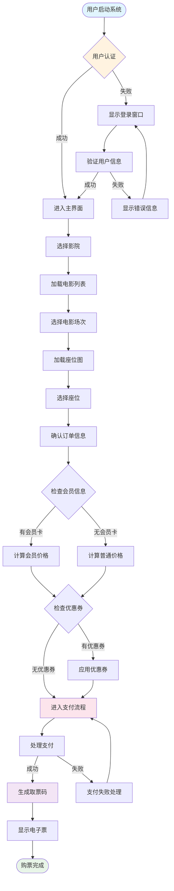
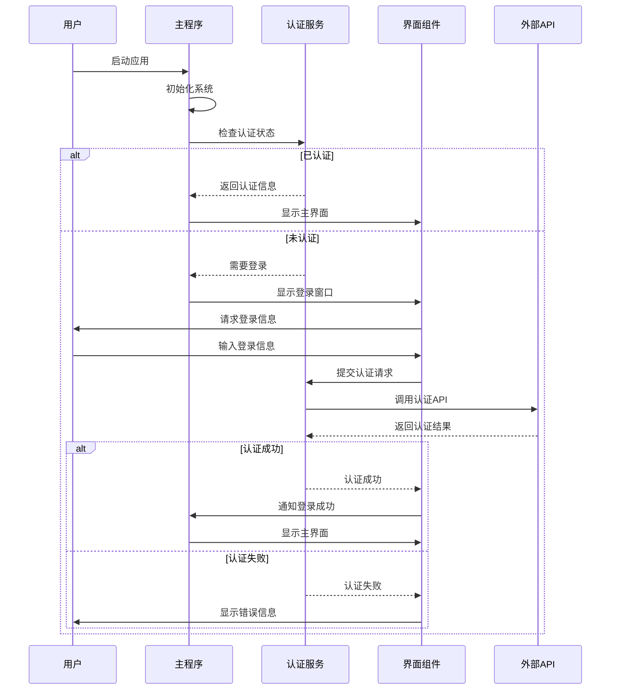
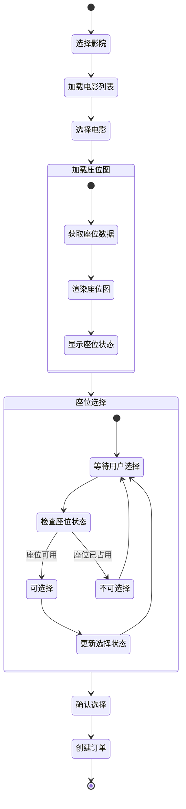
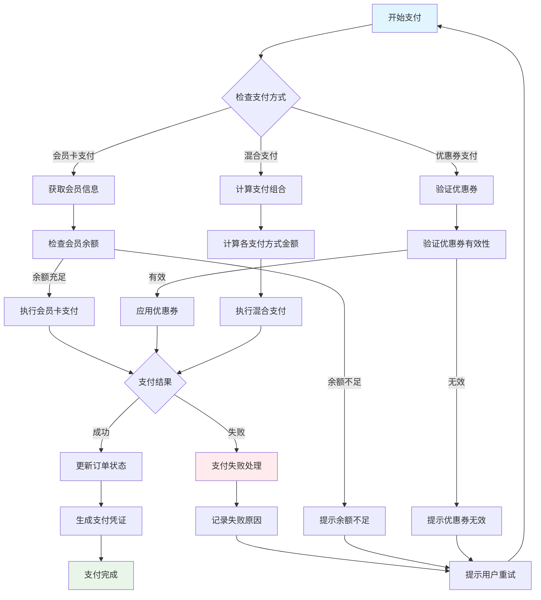

# PyQt5电影票务管理系统 - 业务流程图

## 用户购票完整流程

```mermaid
flowchart TD
    Start([用户启动系统]) --> Auth{用户认证}
    
    Auth -->|成功| MainWindow[进入主界面]
    Auth -->|失败| Login[显示登录窗口]
    Login --> AuthCheck[验证用户信息]
    AuthCheck -->|成功| MainWindow
    AuthCheck -->|失败| ErrorMsg[显示错误信息]
    ErrorMsg --> Login
    
    MainWindow --> SelectCinema[选择影院]
    SelectCinema --> LoadMovies[加载电影列表]
    LoadMovies --> SelectMovie[选择电影场次]
    SelectMovie --> LoadSeats[加载座位图]
    LoadSeats --> SelectSeats[选择座位]
    
    SelectSeats --> ConfirmOrder[确认订单信息]
    ConfirmOrder --> CheckMember{检查会员信息}
    
    CheckMember -->|有会员卡| CalcMemberPrice[计算会员价格]
    CheckMember -->|无会员卡| CalcNormalPrice[计算普通价格]
    
    CalcMemberPrice --> CheckCoupon{检查优惠券}
    CalcNormalPrice --> CheckCoupon
    
    CheckCoupon -->|有优惠券| ApplyCoupon[应用优惠券]
    CheckCoupon -->|无优惠券| Payment[进入支付流程]
    ApplyCoupon --> Payment
    
    Payment --> ProcessPayment[处理支付]
    ProcessPayment -->|成功| GenerateQR[生成取票码]
    ProcessPayment -->|失败| PaymentError[支付失败处理]
    PaymentError --> Payment
    
    GenerateQR --> ShowTicket[显示电子票]
    ShowTicket --> End([购票完成])
    
    style Start fill:#e1f5fe
    style End fill:#e8f5e8
    style Auth fill:#fff3e0
    style Payment fill:#fce4ec
    style GenerateQR fill:#f3e5f5
```

## 系统启动流程

```mermaid
sequenceDiagram
    participant User as 用户
    participant Main as 主程序
    participant Auth as 认证服务
    participant UI as 界面组件
    participant API as 外部API
    
    User->>Main: 启动应用
    Main->>Main: 初始化系统
    Main->>Auth: 检查认证状态
    
    alt 已认证
        Auth-->>Main: 返回认证信息
        Main->>UI: 显示主界面
    else 未认证
        Auth-->>Main: 需要登录
        Main->>UI: 显示登录窗口
        UI->>User: 请求登录信息
        User->>UI: 输入登录信息
        UI->>Auth: 提交认证请求
        Auth->>API: 调用认证API
        API-->>Auth: 返回认证结果
        
        alt 认证成功
            Auth-->>UI: 认证成功
            UI->>Main: 通知登录成功
            Main->>UI: 显示主界面
        else 认证失败
            Auth-->>UI: 认证失败
            UI->>User: 显示错误信息
        end
    end
```

## 座位选择流程

```mermaid
stateDiagram-v2
    [*] --> 选择影院
    选择影院 --> 加载电影列表
    加载电影列表 --> 选择电影
    选择电影 --> 加载座位图
    
    state 加载座位图 {
        [*] --> 获取座位数据
        获取座位数据 --> 渲染座位图
        渲染座位图 --> 显示座位状态
    }
    
    加载座位图 --> 座位选择
    
    state 座位选择 {
        [*] --> 等待用户选择
        等待用户选择 --> 检查座位状态
        检查座位状态 --> 可选择 : 座位可用
        检查座位状态 --> 不可选择 : 座位已占用
        可选择 --> 更新选择状态
        不可选择 --> 等待用户选择
        更新选择状态 --> 等待用户选择
    }
    
    座位选择 --> 确认选择
    确认选择 --> 创建订单
    创建订单 --> [*]
```

## 支付处理流程

```mermaid
graph TD
    A[开始支付] --> B{检查支付方式}
    
    B -->|会员卡支付| C[获取会员信息]
    B -->|优惠券支付| D[验证优惠券]
    B -->|混合支付| E[计算支付组合]
    
    C --> F[检查会员余额]
    F -->|余额充足| G[执行会员卡支付]
    F -->|余额不足| H[提示余额不足]
    
    D --> I[验证优惠券有效性]
    I -->|有效| J[应用优惠券]
    I -->|无效| K[提示优惠券无效]
    
    E --> L[计算各支付方式金额]
    L --> M[执行混合支付]
    
    G --> N{支付结果}
    J --> N
    M --> N
    
    N -->|成功| O[更新订单状态]
    N -->|失败| P[支付失败处理]
    
    O --> Q[生成支付凭证]
    Q --> R[支付完成]
    
    P --> S[记录失败原因]
    S --> T[提示用户重试]
    T --> A
    
    H --> T
    K --> T
    
    style A fill:#e1f5fe
    style R fill:#e8f5e8
    style P fill:#ffebee
```
