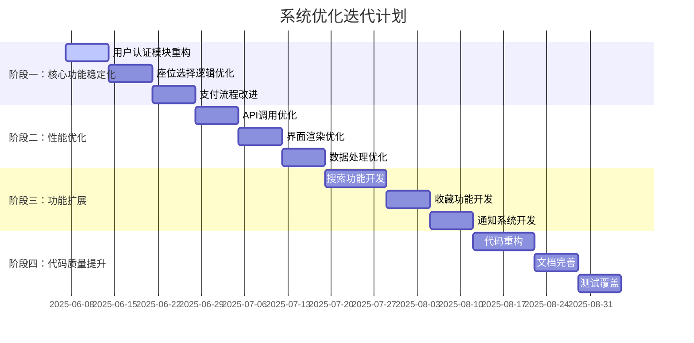
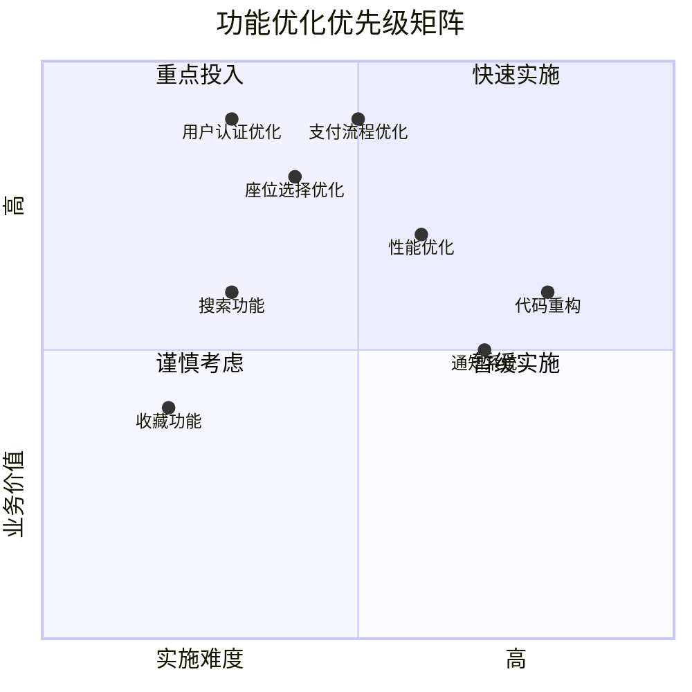
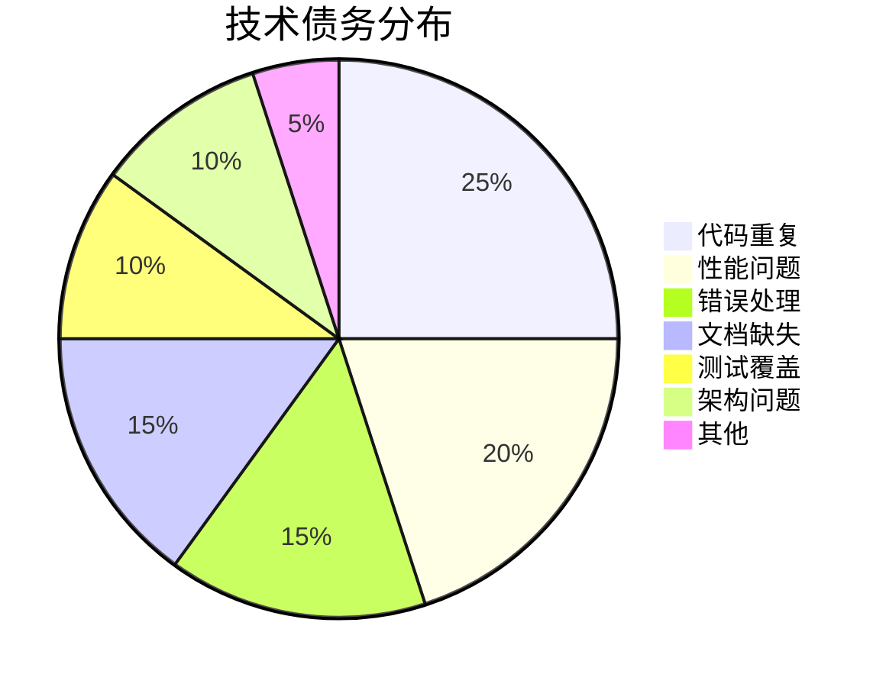

# PyQt5电影票务管理系统 - 优化路线图

## 优化阶段时间线

```mermaid
gantt
    title 系统优化迭代计划
    dateFormat  YYYY-MM-DD
    section 阶段一：核心功能稳定化
    用户认证模块重构    :active, auth, 2025-06-07, 7d
    座位选择逻辑优化    :seat, after auth, 7d
    支付流程改进       :payment, after seat, 7d
    
    section 阶段二：性能优化
    API调用优化       :api, after payment, 7d
    界面渲染优化      :ui, after api, 7d
    数据处理优化      :data, after ui, 7d
    
    section 阶段三：功能扩展
    搜索功能开发      :search, after data, 10d
    收藏功能开发      :favorite, after search, 7d
    通知系统开发      :notify, after favorite, 7d
    
    section 阶段四：代码质量提升
    代码重构         :refactor, after notify, 10d
    文档完善         :docs, after refactor, 7d
    测试覆盖         :test, after docs, 7d
```

## 优化优先级矩阵

```mermaid
quadrantChart
    title 功能优化优先级矩阵
    x-axis 实施难度 --> 高
    y-axis 业务价值 --> 高
    
    quadrant-1 快速实施
    quadrant-2 重点投入
    quadrant-3 谨慎考虑
    quadrant-4 暂缓实施
    
    用户认证优化: [0.3, 0.9]
    座位选择优化: [0.4, 0.8]
    支付流程优化: [0.5, 0.9]
    性能优化: [0.6, 0.7]
    搜索功能: [0.3, 0.6]
    收藏功能: [0.2, 0.4]
    通知系统: [0.7, 0.5]
    代码重构: [0.8, 0.6]
```

## 技术债务分析

```mermaid
pie title 技术债务分布
    "代码重复" : 25
    "性能问题" : 20
    "错误处理" : 15
    "文档缺失" : 15
    "测试覆盖" : 10
    "架构问题" : 10
    "其他" : 5
```
