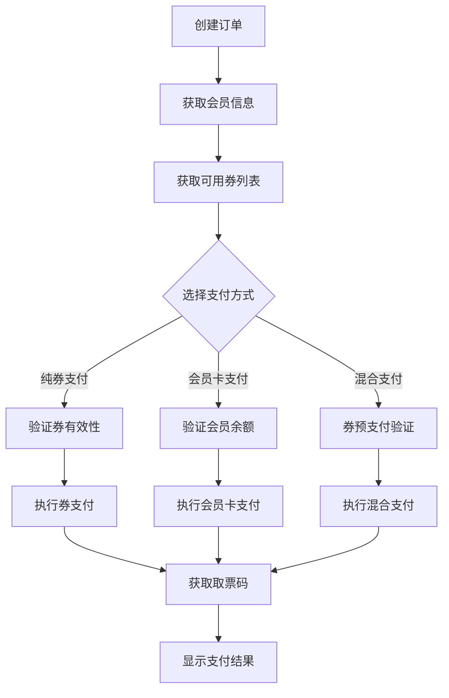

# PyQt5电影票务管理系统 - 支付方式技术分析报告

## 📋 分析概述

基于两个HAR抓包文件的分析，我们识别出了现有系统之外的多种支付方式，可以显著扩展PyQt5电影票务管理系统的支付能力。

### 📁 分析的文件
1. `大都荟混合下单_05_30_10_58_38.har` - 混合支付方式抓包（15个请求）
2. `大都荟下单2025_05_25_17_58_35.har` - 其他支付方式抓包（12个请求）

---

## 🎯 识别的支付方式

### 1. 💳 会员卡支付 (Member Card Payment)

**API接口信息：**
- **端点**：`/MiniTicket/index.php/MiniPay/memcardPay`
- **方法**：POST
- **内容类型**：application/x-www-form-urlencoded

**关键参数：**
```python
{
    'totalprice': '4990',           # 总价（分）
    'memberinfo': '{...}',          # 会员信息JSON
    'mempass': '710254',            # 会员密码
    'orderno': '202505301058196041368',  # 订单号
    'couponcodes': '83839924607',   # 券码（可选）
    'price': '3000',                # 原价（分）
    'discountprice': '1010',        # 券抵扣金额（分）
    'filmname': '碟中谍8：最终清算',  # 影片名称
    'featureno': '87642505236JZJF2', # 场次编号
    'ticketcount': '2',             # 票数
    'cinemaname': '华夏伟业加荟大都荟', # 影院名称
    'cinemaid': '35fec8259e74',     # 影院ID
    'userid': '15155712316',        # 用户ID
    'openid': 'oAOCp7VbeeoqMM4yC8e2i3G3lxI8', # 微信OpenID
    'token': '3a30b9e980892714',    # 认证Token
    'source': '2'                   # 来源标识
}
```

**会员信息结构：**
```json
{
    "cardno": "15155712316",
    "mobile": "15155712316", 
    "memberId": "15155712316",
    "cardtype": "0",
    "cardcinemaid": "35fec8259e74",
    "balance": 542.9
}
```

**响应格式：**
```json
{
    "resultCode": "0",
    "resultDesc": "会员卡支付成功！",
    "resultData": null
}
```

### 2. 🎫 券预支付验证 (Coupon Prepay Validation)

**API接口信息：**
- **端点**：`/MiniTicket/index.php/MiniOrder/ordercouponPrepay`
- **方法**：GET

**关键参数：**
```python
{
    'orderno': '202505301058196041368',
    'couponcode': '83839924607',    # 单券或多券用逗号分隔
    'cinemaid': '35fec8259e74',
    'userid': '15155712316',
    'openid': 'oAOCp7VbeeoqMM4yC8e2i3G3lxI8',
    'token': '3a30b9e980892714',
    'source': '2'
}
```

**响应数据结构：**
```json
{
    "resultCode": "0",
    "resultDesc": "成功",
    "resultData": {
        "covTdiscount": 1000,           # 券总抵扣（分）
        "discounts": 500,               # 折扣金额（分）
        "covGdiscount": 1600,           # 券组合抵扣（分）
        "displayText": "已选1张",        # 显示文本
        "couponcount": 1,               # 券数量
        "oldPayAmount": 3000,           # 原支付金额（分）
        "ticketAmount": 0,              # 票务金额
        "totalprice": "7000",           # 总价（分）
        "totalmemprice": "6000",        # 会员总价（分）
        "paymentAmount": "5490",        # 实付金额（分）
        "mempaymentAmount": "4990",     # 会员实付金额（分）
        "bindType": 1,                  # 绑定类型
        "discountmemprice": "1010",     # 会员券抵扣（分）
        "discountprice": "1510",        # 券抵扣（分）
        "couponcodes": "83839924607",   # 使用的券码
        "dyCouponcodes": "",            # 动态券码
        "dyOrderId": null,              # 动态订单ID
        "dyOrderList": [],              # 动态订单列表
        "poiId": null,                  # POI ID
        "verifyToken": null             # 验证Token
    }
}
```

### 3. 🎟️ 券信息获取 (Coupon Information)

**API接口信息：**
- **端点**：`/MiniTicket/index.php/MiniCoupon/getCouponByOrder`
- **方法**：GET

**关键参数：**
```python
{
    'pageNo': '1',
    'voucherType': 'checkbox',      # 或 'count'
    'orderno': '202505301058196041368',
    'cinemaid': '35fec8259e74',
    'userid': '15155712316',
    'openid': 'oAOCp7VbeeoqMM4yC8e2i3G3lxI8',
    'token': '3a30b9e980892714',
    'source': '2'
}
```

---

## 🔄 支付流程分析

### 完整支付流程



### 混合支付详细流程

1. **订单创建阶段**
   - 调用 `createOrder` 创建订单
   - 获取订单号和基础信息

2. **信息收集阶段**
   - 调用 `getMemberInfo` 获取会员信息和余额
   - 调用 `getCouponByOrder` 获取可用券列表

3. **预支付验证阶段**
   - 用户选择券和支付方式
   - 调用 `ordercouponPrepay` 验证券抵扣
   - 计算实际需要支付的金额

4. **支付执行阶段**
   - 调用 `memcardPay` 执行混合支付
   - 传入券码和会员信息
   - 系统自动处理券抵扣和余额扣减

5. **结果处理阶段**
   - 支付成功后获取取票码
   - 更新订单状态
   - 显示支付结果

---

## 💡 与现有系统的对比

### 现有系统支持
- ✅ 纯券支付（Coupon Only Payment）
- ✅ 券列表获取和选择
- ✅ 基础订单创建和管理

### 新增支付方式
- 🆕 **会员卡支付**：使用会员卡余额直接支付
- 🆕 **混合支付**：券抵扣 + 会员卡余额支付剩余金额
- 🆕 **预支付验证**：实时计算券抵扣和实付金额
- 🆕 **会员信息集成**：会员余额查询和密码验证

### 参数格式差异

| 字段 | 现有系统 | 新增支付方式 | 说明 |
|------|----------|--------------|------|
| 金额单位 | 元（浮点数） | 分（整数） | 需要转换 |
| 券码格式 | 单个券码 | 逗号分隔多券码 | 支持多券组合 |
| 会员信息 | 简单字段 | JSON对象 | 更复杂的结构 |
| 支付验证 | 客户端计算 | 服务端验证 | 更准确可靠 |

---

## 🛠️ 集成实施方案

### 1. UI界面扩展

**支付方式选择界面：**
```python
class PaymentMethodDialog(QDialog):
    def __init__(self, parent=None):
        super().__init__(parent)
        self.setup_ui()
    
    def setup_ui(self):
        layout = QVBoxLayout()
        
        # 支付方式选择
        self.payment_group = QButtonGroup()
        
        self.coupon_only_radio = QRadioButton("纯券支付")
        self.member_card_radio = QRadioButton("会员卡支付") 
        self.mixed_payment_radio = QRadioButton("混合支付（券+会员卡）")
        
        self.payment_group.addButton(self.coupon_only_radio, 0)
        self.payment_group.addButton(self.member_card_radio, 1)
        self.payment_group.addButton(self.mixed_payment_radio, 2)
        
        layout.addWidget(self.coupon_only_radio)
        layout.addWidget(self.member_card_radio)
        layout.addWidget(self.mixed_payment_radio)
        
        # 会员信息显示
        self.member_info_widget = self.create_member_info_widget()
        layout.addWidget(self.member_info_widget)
        
        # 券选择区域
        self.coupon_widget = self.create_coupon_widget()
        layout.addWidget(self.coupon_widget)
        
        # 金额计算显示
        self.amount_widget = self.create_amount_widget()
        layout.addWidget(self.amount_widget)
        
        # 确认按钮
        button_layout = QHBoxLayout()
        self.confirm_btn = QPushButton("确认支付")
        self.cancel_btn = QPushButton("取消")
        
        button_layout.addWidget(self.confirm_btn)
        button_layout.addWidget(self.cancel_btn)
        layout.addLayout(button_layout)
        
        self.setLayout(layout)
```

### 2. API客户端扩展

**新增API方法：**
```python
class EnhancedAPIClient(APIClient):
    def validate_coupon_prepay(self, order_no: str, coupon_codes: str) -> Dict[str, Any]:
        """验证券预支付"""
        params = {
            'orderno': order_no,
            'couponcode': coupon_codes,
            'cinemaid': self.cinema_id,
            'userid': self.user_id,
            'openid': self.openid,
            'token': self.token,
            'source': '2'
        }
        return self.get('/MiniTicket/index.php/MiniOrder/ordercouponPrepay', params)
    
    def process_member_card_payment(self, payment_data: Dict[str, Any]) -> Dict[str, Any]:
        """处理会员卡支付"""
        return self.post('/MiniTicket/index.php/MiniPay/memcardPay', payment_data)
    
    def get_member_info(self) -> Dict[str, Any]:
        """获取会员信息"""
        params = {
            'cinemaid': self.cinema_id,
            'userid': self.user_id,
            'openid': self.openid,
            'token': self.token,
            'source': '2'
        }
        return self.get('/MiniTicket/index.php/MiniMember/getMemberInfo', params)
```

### 3. 数据转换工具

**金额单位转换：**
```python
class PaymentUtils:
    @staticmethod
    def yuan_to_fen(yuan_amount: float) -> int:
        """元转分"""
        return int(yuan_amount * 100)
    
    @staticmethod
    def fen_to_yuan(fen_amount: int) -> float:
        """分转元"""
        return fen_amount / 100.0
    
    @staticmethod
    def format_coupon_codes(coupon_list: List[Dict]) -> str:
        """格式化券码"""
        return ','.join([c.get('couponcode', '') for c in coupon_list])
    
    @staticmethod
    def format_member_info(member_data: Dict) -> str:
        """格式化会员信息为JSON字符串"""
        return json.dumps({
            'cardno': member_data.get('cardno', ''),
            'mobile': member_data.get('mobile', ''),
            'memberId': member_data.get('memberId', ''),
            'cardtype': '0',
            'cardcinemaid': member_data.get('cardcinemaid', ''),
            'balance': member_data.get('balance', 0)
        })
```

---

## 🔒 安全考虑

### 1. 会员密码处理
- 使用 `QLineEdit.Password` 模式输入
- 不在内存中长期存储密码
- 传输时使用HTTPS加密

### 2. 金额验证
- 客户端和服务端双重验证
- 使用分为单位避免浮点数精度问题
- 实时验证券抵扣金额

### 3. 会员信息保护
- 敏感信息加密存储
- 会员余额实时查询
- 支付前二次确认

---

## 📈 预期效果

### 用户体验提升
- 🎯 **支付方式多样化**：从1种增加到3种支付方式
- 💰 **成本优化**：券+会员卡组合使用，最大化优惠
- ⚡ **支付效率**：预验证机制，减少支付失败率
- 🔄 **流程简化**：一键混合支付，无需手动计算

### 技术架构优化
- 🏗️ **模块化设计**：支付方式可插拔扩展
- 🔧 **API统一化**：标准化的支付接口
- 📊 **数据一致性**：统一的金额和券码格式
- 🛡️ **安全增强**：服务端验证和加密传输

### 业务价值
- 📊 **用户留存**：多样化支付提升用户满意度
- 💳 **会员活跃**：会员卡支付促进会员使用
- 🎫 **券使用率**：混合支付提高券的使用效率
- 📈 **收入增长**：便捷支付提升转化率

---

## 🚀 实施建议

### 开发优先级
1. **第一阶段**：实现会员信息获取和显示
2. **第二阶段**：添加券预支付验证功能
3. **第三阶段**：实现会员卡支付
4. **第四阶段**：完善混合支付逻辑
5. **第五阶段**：UI优化和用户体验提升

### 测试策略
- **单元测试**：API调用和数据转换
- **集成测试**：支付流程端到端测试
- **用户测试**：真实场景下的支付体验
- **安全测试**：支付安全和数据保护

### 部署建议
- **灰度发布**：先在部分用户中测试
- **监控告警**：支付成功率和错误监控
- **回滚方案**：保留原有纯券支付作为备选
- **用户培训**：提供新支付方式使用指南

---

**分析完成时间**：2024年12月  
**建议实施周期**：2-3周  
**预期上线时间**：1个月内
