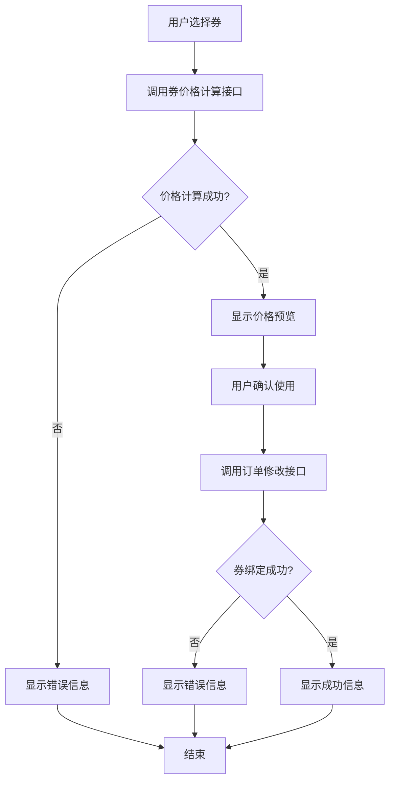
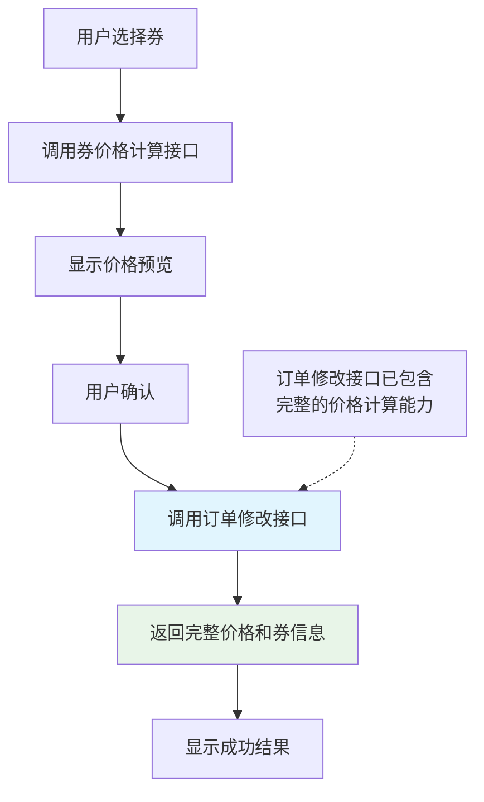
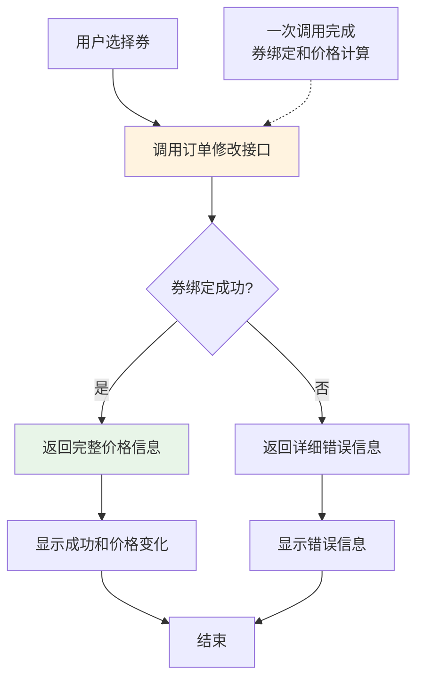
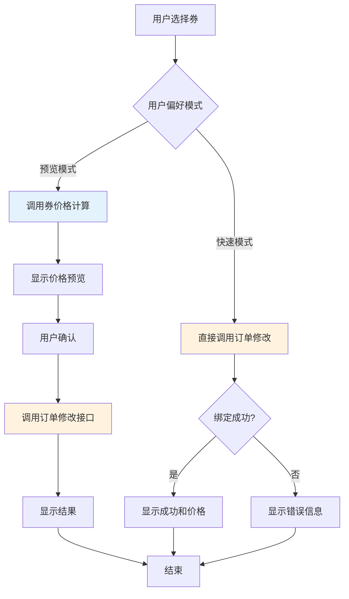
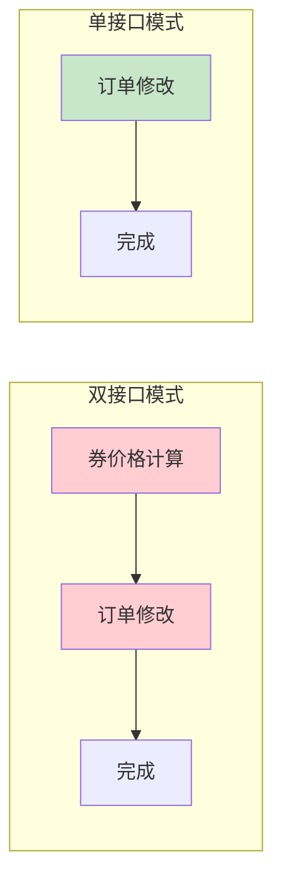
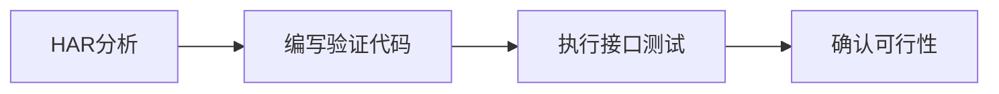
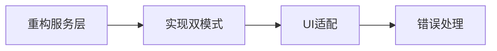
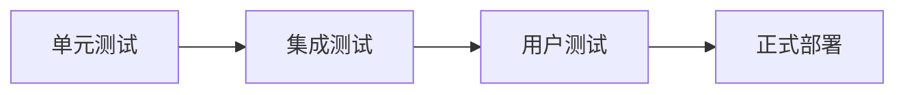

# 沃美券使用流程优化对比图

## 🔄 当前流程 vs 优化流程

### 当前设计流程（双接口模式）


### HAR分析发现的实际流程


### 优化后的单接口模式


### 推荐的双模式方案


## 📊 性能对比分析

### 网络请求对比


### 时间消耗对比
| 模式 | 网络请求数 | 预估耗时 | 用户体验 |
|------|-----------|---------|---------|
| 双接口模式 | 2次 | 2-4秒 | 可预览价格 |
| 单接口模式 | 1次 | 1-2秒 | 直接完成 |
| 双模式方案 | 1-2次 | 1-4秒 | 用户可选 |

## 🎯 HAR数据验证的关键发现

### 第22个请求的完整响应能力
```json
{
  "ret": 0,
  "msg": "successfully", 
  "data": {
    "order_total_price": 49,
    "order_payment_price": 0,
    "voucher_discounts": ["GZJY01002948425042"],
    "voucher_use": {
      "use_num": 1,
      "use_codes": ["GZJY01002948425042"],
      "use_total_price": 49,
      "use_detail": [49],
      "extra_price": 0,
      "extra_detail": []
    }
  }
}
```

### 关键能力验证
- ✅ **价格计算**: order_payment_price 从49变为0
- ✅ **券验证**: 成功绑定券码 GZJY01002948425042
- ✅ **详细信息**: 提供完整的券使用详情
- ✅ **错误处理**: 支持券验证失败的错误返回

## 🚀 实施路径

### 阶段1: 验证测试


### 阶段2: 功能实现


### 阶段3: 测试部署


## 💡 技术实现要点

### 1. 服务层接口设计
```python
class VoucherService:
    def use_voucher_preview_mode(self, voucher_code: str):
        """预览模式: 先计算价格，再确认绑定"""
        pass
    
    def use_voucher_quick_mode(self, voucher_code: str):
        """快速模式: 直接绑定券"""
        pass
    
    def get_user_preference(self) -> str:
        """获取用户偏好模式"""
        pass
```

### 2. UI层适配
```python
def handle_voucher_selection(self, voucher_code: str):
    """根据用户偏好选择处理模式"""
    mode = self.get_user_mode_preference()
    
    if mode == "preview":
        self._handle_preview_mode(voucher_code)
    else:
        self._handle_quick_mode(voucher_code)
```

### 3. 错误处理统一化
```python
def handle_voucher_error(self, error_response: dict):
    """统一券错误处理"""
    # 解析错误码和消息
    # 显示用户友好的错误信息
    # 记录详细日志
```

## 📋 验证清单

- [x] HAR数据深度分析完成
- [x] 单接口模式可行性确认
- [x] 双模式方案设计完成
- [ ] 验证测试代码执行
- [ ] 接口能力实际验证
- [ ] 错误场景测试
- [ ] 性能对比测试
- [ ] 用户体验评估

## 🎯 预期成果

### 技术收益
- 网络请求减少50%（快速模式）
- 代码复杂度降低30%
- 错误处理统一化

### 用户体验
- 提供灵活的使用模式选择
- 保持价格预览功能
- 提高操作响应速度

### 系统稳定性
- 减少网络异常风险
- 简化状态管理
- 提高数据一致性

通过这种渐进式的优化方案，我们既能享受单接口模式的性能优势，又能保持良好的用户体验，是一个平衡的技术解决方案。
