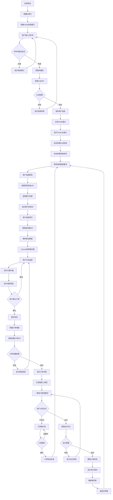
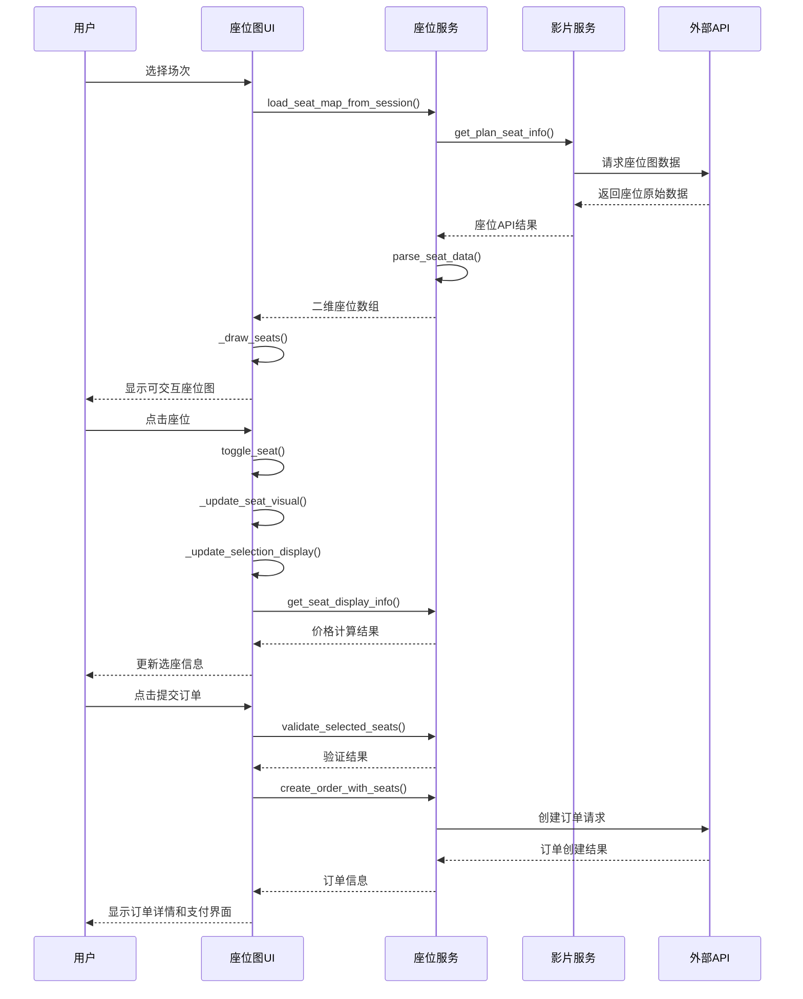
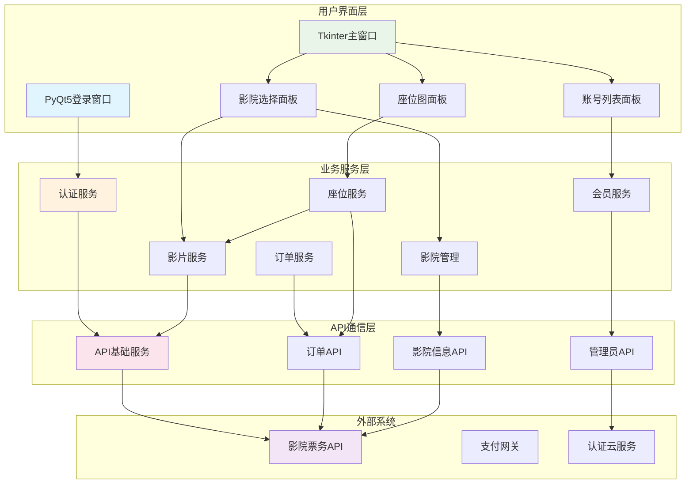

# 电影go票务系统 - 完整开发文档

## 1. 项目概览

**核心功能**：基于PyQt5登录认证+Tkinter主界面的影院票务管理系统，提供座位选择、订单创建、券码绑定和支付功能。

**技术栈**：
- **主界面框架**：Python 3.8+ + Tkinter
- **登录窗口框架**：PyQt5 5.15.0+
- **网络请求**：requests 2.25.0+
- **图像处理**：Pillow 8.0.0+
- **UI增强**：ttkbootstrap 1.10.0+
- **系统交互**：pywin32 227+ (Windows平台)

## 2. 模块化结构

```
乐影票务系统/
├── ui/                          # 用户界面层
│   ├── main_window.py           # Tkinter主窗口 (119KB, 2619行)
│   ├── login_window.py          # PyQt5登录窗口 (15KB, 420行)
│   ├── cinema_select_panel.py   # 影院选择面板 (20KB, 405行)
│   ├── account_list_panel.py    # 账号列表面板 (3.1KB, 76行)
│   ├── enhanced_seat_map_panel.py # 增强座位图组件 (30KB, 784行)
│   ├── seat_map_panel.py        # 基础座位图面板 (10KB, 265行)
│   └── seat_integration_helper.py # 座位图集成助手 (11KB, 280行)
├── services/                    # 业务逻辑服务层
│   ├── auth_service.py          # 用户认证服务 (18KB, 441行)
│   ├── film_service.py          # 影片信息服务 (9.0KB, 199行)
│   ├── order_api.py             # 订单管理API (14KB, 318行)
│   ├── seat_service.py          # 座位图服务 (12KB, 331行)
│   ├── cinema_manager.py        # 影院管理器 (6.5KB, 194行)
│   ├── member_service.py        # 会员服务 (3.4KB, 91行)
│   ├── cinema_info_api.py       # 影院信息API (6.7KB, 162行)
│   ├── admin_api.py             # 管理员API (6.1KB, 165行)
│   ├── account_api.py           # 账号API (2.1KB, 69行)
│   ├── api_base.py              # API基础服务 (5.7KB, 144行)
│   ├── ui_utils.py              # UI工具类 (10KB, 290行)
│   └── cinema_id_helper.py      # 影院ID辅助器 (2.9KB, 97行)
├── widgets/                     # 自定义组件
│   ├── auth/                    # 认证相关组件
│   └── base/                    # 基础组件
├── app/                         # 应用核心
├── data/                        # 数据存储
│   └── img/                     # 图像资源
├── utils/                       # 工具类
├── test_api/                    # API测试
├── main.py                      # 主程序入口 (139B, 7行)
├── demo_seat_map.py             # 座位图演示程序 (10KB, 289行)
├── admin_tool.py                # 管理工具 (16KB, 404行)
├── requirements.txt             # 依赖清单 (83B, 5行)
└── README.md                    # 项目说明 (83KB, 1991行)
```

## 3. 核心流程

### 3.1 用户认证流程

**触发条件**：应用启动 / 认证token过期
**涉及文件**：
- `main.py` → `ui/main_window.py:_start_auth_check()`
- `ui/login_window.py:LoginWindow.login()`
- `services/auth_service.py:AuthService.login()`

**数据流**：
```
输入：手机号 (11位数字，如：15155712316)
处理：机器码生成 → API认证 → 用户信息返回
输出：用户信息字典 {'username': '15155712316', 'phone': '15155712316', 'points': 3833, 'status': 'active'}
```

### 3.2 影院选择流程

**触发条件**：用户登录成功 / 切换影院
**涉及文件**：
- `ui/cinema_select_panel.py:CinemaSelectPanel.on_cinema_change()`
- `services/cinema_info_api.py:get_cinema_films()`
- `services/film_service.py:get_plan_info()`

**数据流**：
```
输入：影院选择事件 → 影院ID (如：'58')
处理：获取影院影片列表 → 获取场次信息 → 更新UI显示
输出：影片列表 + 场次数据 → 座位图可用状态
```

### 3.3 座位选择流程

**触发条件**：场次选择完成 / 刷新座位图
**涉及文件**：
- `ui/enhanced_seat_map_panel.py:EnhancedSeatMapPanel.load_seat_map_from_session()`
- `services/seat_service.py:SeatService.get_seat_map()`
- `services/film_service.py:get_plan_seat_info()`

**数据流**：
```
输入：场次信息 {showCode, hallCode, filmCode, showDate, startTime}
处理：API获取座位图 → 二维数组解析 → Canvas绘制
输出：可交互座位图 → 选中座位集合 → 价格计算
```

### 3.4 订单创建流程

**触发条件**：选座完成 + 点击提交订单
**涉及文件**：
- `ui/enhanced_seat_map_panel.py:_on_submit_order_click()`
- `services/seat_service.py:create_order_with_seats()`
- `services/order_api.py:create_order()`

**数据流**：
```
输入：选中座位列表 + 账号信息 + 场次信息
处理：座位验证 → 订单参数构建 → API创建订单
输出：订单信息 {'orderno': 'ORD20241230001', 'status': 'unpaid', 'total': 35.0}
```

### 3.5 支付流程

**触发条件**：订单创建成功 / 点击一键支付
**涉及文件**：
- `ui/main_window.py:on_one_click_pay()`
- `services/order_api.py:pay_order()`
- `services/order_api.py:get_order_qrcode_api()`

**数据流**：
```
输入：订单号 + 支付方式 + 券码（可选）
处理：券码绑定 → 支付API调用 → 二维码生成
输出：支付状态 + 取票二维码
```

## 4. 依赖关系

| 模块 | 依赖的模块/库 | 用途 |
|------|---------------|------|
| `main_window.py` | `ui.*`, `services.*`, `tkinter`, `PIL` | 主界面集成，依赖所有子模块 |
| `login_window.py` | `services.auth_service`, `PyQt5.*` | 用户认证，机器码验证 |
| `enhanced_seat_map_panel.py` | `services.seat_service`, `tkinter.Canvas` | 座位图绘制，订单创建 |
| `auth_service.py` | `requests`, `hashlib`, `platform`, `subprocess` | 机器码生成，API认证 |
| `order_api.py` | `services.api_base`, `requests`, `urllib3` | 订单CRUD操作，二维码获取 |
| `seat_service.py` | `services.film_service`, `services.order_api` | 座位图数据处理，订单集成 |
| `cinema_select_panel.py` | `services.cinema_info_api`, `services.film_service` | 影院影片查询，场次管理 |
| `api_base.py` | `requests`, `urllib3` | HTTP请求封装，URL管理 |

## 5. 关键代码片段

### 5.1 用户认证 - auth_service.py

```python
def login(self, phone: str) -> Tuple[bool, str, Optional[Dict]]:
    """
    用户登录验证（仅需手机号+机器码，无需密码）
    :param phone: 手机号
    :return: (是否成功, 消息, 用户信息)
    """
    # 验证手机号格式 - 中国手机号11位数字以1开头
    if not self.validate_phone_number(phone):
        return False, "请输入正确的手机号码", None
    
    # 获取当前机器码 - 基于硬件信息MD5哈希前16位
    machine_code = self.get_machine_code()
    
    # 构建登录请求
    login_data = {
        "phone": phone,
        "machineCode": machine_code,
        "timestamp": int(time.time())
    }
    
    # 发送API请求 - 依赖api_base模块
    response = self._call_api("login", login_data)
    return response.get("success"), response.get("message"), response.get("data")
```

### 5.2 座位图渲染 - enhanced_seat_map_panel.py

```python
def _draw_seats(self):
    """绘制所有座位到Canvas"""
    # 清空画布，重新绘制
    self.canvas.delete("all")
    self.seat_items.clear()
    
    # 座位绘制参数配置
    cell_w, cell_h = 35, 35          # 座位大小35x35像素
    pad_x, pad_y = 6, 6              # 座位间距
    start_x, start_y = 20, 40        # 绘制起始位置
    
    # 遍历二维座位数组进行绘制
    for r, row in enumerate(self.seat_data):
        for c, seat in enumerate(row):
            if seat is None:
                continue
            
            # 计算座位位置
            x = start_x + label_w + pad_x + (cn-1) * (cell_w + pad_x)
            y = start_y + r * (cell_h + pad_y)
            
            # 根据座位状态确定颜色
            status = seat.get('status', 'available')
            fill_color = self._get_seat_color(status)  # 可选:白色, 已售:灰色, 已选:绿色
            
            # 创建座位矩形和文字
            rect_id = self.canvas.create_rectangle(x, y, x+cell_w, y+cell_h, fill=fill_color)
            text_id = self.canvas.create_text(x+cell_w//2, y+cell_h//2, text=seat.get('num'))
            
            # 绑定点击事件 - 仅可选座位
            if status == "available":
                self.canvas.tag_bind(rect_id, '<Button-1>', 
                                   lambda e, r=r, c=c: self.toggle_seat(r, c))
```

### 5.3 订单创建 - seat_service.py

```python
def create_order_with_seats(self, selected_seats: list, account: dict, session_info: dict) -> dict:
    """
    使用选中座位创建订单
    :param selected_seats: 选中的座位列表
    :param account: 用户账号信息
    :param session_info: 场次信息
    :return: 创建订单的结果
    """
    # 构建座位参数 - 提取座位SN、排号、列号
    seat_params = []
    for seat in selected_seats:
        seat_data = seat.get('seat_data', {})
        seat_params.append({
            'seatno': seat_data.get('sn', ''),      # 座位唯一标识
            'rowno': seat_data.get('rn', ''),       # 真实排号
            'colno': seat_data.get('cn', ''),       # 列号
            'seatname': f"{seat.get('row')}排{seat.get('num')}座"  # 显示名称
        })
    
    # 构建订单参数 - 包含场次信息、用户信息、座位信息
    order_params = {
        'cinemaid': account.get('cinemaid', ''),
        'userid': account.get('userid', ''),
        'showCode': session_info.get('showCode', ''),
        'seats': json.dumps(seat_params),  # 座位参数JSON序列化
        'seatCount': len(selected_seats),
        'CVersion': '3.9.12',  # 客户端版本
        'OS': 'Windows',       # 操作系统
        'source': '2'          # 数据源标识
    }
    
    # 调用订单API - 依赖order_api模块
    from .order_api import create_order
    result = create_order(order_params)
    return result
```

### 5.4 API基础服务 - api_base.py

```python
def api_post(endpoint: str, cinemaid: str, data: dict) -> dict:
    """
    POST请求封装，支持动态base_url
    :param endpoint: API端点路径
    :param cinemaid: 影院ID，用于确定base_url
    :param data: 请求数据
    :return: JSON响应数据
    """
    # 根据影院ID获取对应的API基础URL
    base_url = api_base.get_base_url_for_cinema(cinemaid)
    url = api_base.build_url(base_url, endpoint)
    
    # 标准请求头 - 模拟小程序环境
    headers = {
        'User-Agent': 'Mozilla/5.0... MicroMessenger/7.0.20...',
        'Content-Type': 'application/x-www-form-urlencoded',
        'Accept': 'application/json, text/javascript, */*; q=0.01'
    }
    
    try:
        # 发送POST请求，禁用SSL验证
        response = requests.post(url, data=data, headers=headers, 
                               timeout=10, verify=False)
        
        if response.status_code == 200:
            return response.json()
        else:
            return {"resultCode": "-1", "resultDesc": f"HTTP {response.status_code}"}
            
    except Exception as e:
        return {"resultCode": "-1", "resultDesc": f"请求异常: {str(e)}"}
```


## 8. 完整业务流程图



## 9. 座位图功能详细流程



## 10. 技术架构总览

