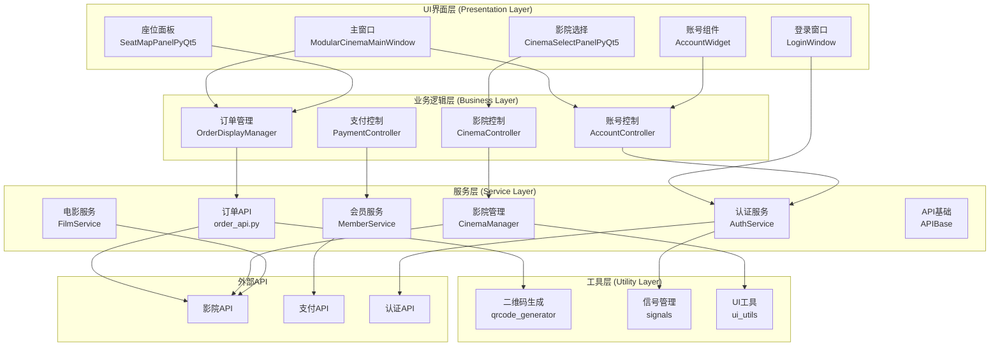
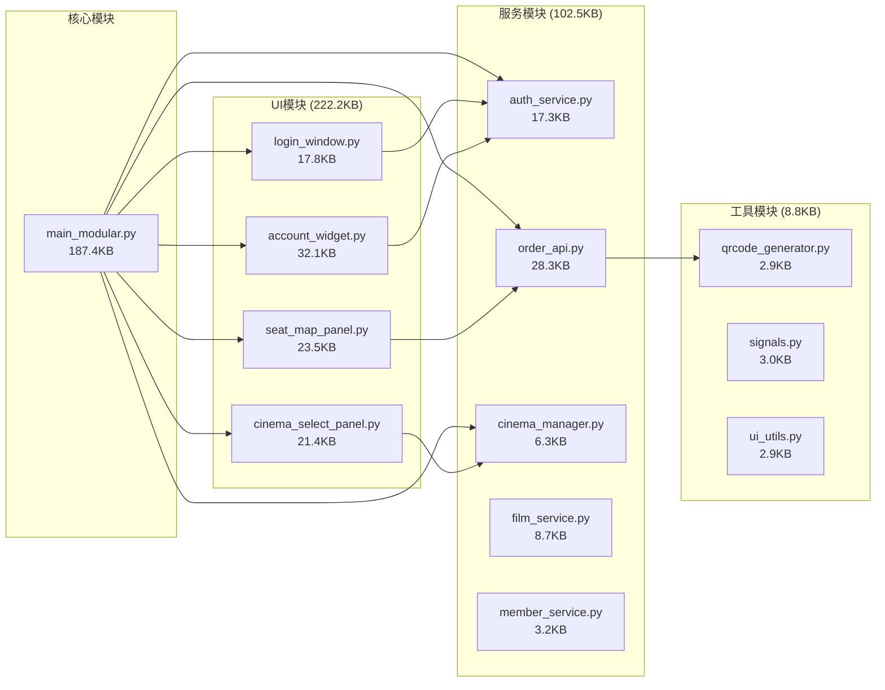

# PyQt5电影票务管理系统 - 系统架构图

## 整体架构图

```mermaid
graph TB
    subgraph "UI界面层 (Presentation Layer)"
        A1[主窗口<br/>ModularCinemaMainWindow]
        A2[登录窗口<br/>LoginWindow]
        A3[座位面板<br/>SeatMapPanelPyQt5]
        A4[影院选择<br/>CinemaSelectPanelPyQt5]
        A5[账号组件<br/>AccountWidget]
    end
    
    subgraph "业务逻辑层 (Business Layer)"
        B1[订单管理<br/>OrderDisplayManager]
        B2[账号控制<br/>AccountController]
        B3[影院控制<br/>CinemaController]
        B4[支付控制<br/>PaymentController]
    end
    
    subgraph "服务层 (Service Layer)"
        C1[认证服务<br/>AuthService]
        C2[订单API<br/>order_api.py]
        C3[影院管理<br/>CinemaManager]
        C4[会员服务<br/>MemberService]
        C5[电影服务<br/>FilmService]
        C6[API基础<br/>APIBase]
    end
    
    subgraph "工具层 (Utility Layer)"
        D1[二维码生成<br/>qrcode_generator]
        D2[信号管理<br/>signals]
        D3[UI工具<br/>ui_utils]
    end
    
    subgraph "外部API"
        E1[影院API]
        E2[支付API]
        E3[认证API]
    end
    
    A1 --> B1
    A1 --> B2
    A2 --> C1
    A3 --> B1
    A4 --> B3
    A5 --> B2
    
    B1 --> C2
    B2 --> C1
    B3 --> C3
    B4 --> C4
    
    C1 --> E3
    C2 --> E1
    C3 --> E1
    C4 --> E2
    C5 --> E1
    
    C1 --> D2
    C2 --> D1
    C3 --> D3
```

## 模块依赖关系图

```mermaid
graph LR
    subgraph "核心模块"
        M1[main_modular.py<br/>187.4KB]
    end
    
    subgraph "服务模块 (102.5KB)"
        S1[auth_service.py<br/>17.3KB]
        S2[order_api.py<br/>28.3KB]
        S3[cinema_manager.py<br/>6.3KB]
        S4[film_service.py<br/>8.7KB]
        S5[member_service.py<br/>3.2KB]
    end
    
    subgraph "UI模块 (222.2KB)"
        U1[login_window.py<br/>17.8KB]
        U2[seat_map_panel.py<br/>23.5KB]
        U3[cinema_select_panel.py<br/>21.4KB]
        U4[account_widget.py<br/>32.1KB]
    end
    
    subgraph "工具模块 (8.8KB)"
        T1[qrcode_generator.py<br/>2.9KB]
        T2[signals.py<br/>3.0KB]
        T3[ui_utils.py<br/>2.9KB]
    end
    
    M1 --> S1
    M1 --> S2
    M1 --> S3
    M1 --> U1
    M1 --> U2
    M1 --> U3
    M1 --> U4
    
    S2 --> T1
    U1 --> S1
    U2 --> S2
    U3 --> S3
    U4 --> S1
```
